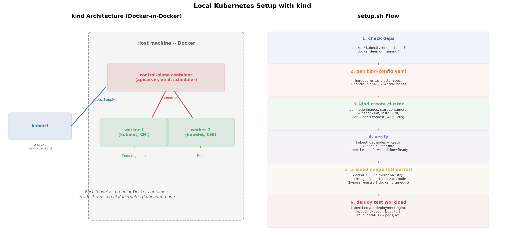

# 本地 Kubernetes 环境搭建: kind

## 1. 引言

学 Kubernetes 最大的门槛不是概念，而是**环境**：云上集群要花钱，公司集群不敢乱搞。本地搭一套随时可删可重建的集群，是学习效率最高的方式——错了就 `kind delete cluster` 重来，零成本。

本地 K8s 三个主流方案对比:

| 维度 | kind | minikube | k3s / k3d |
|------|------|----------|-----------|
| 实现方式 | Docker 容器当节点 (kubeadm) | VM 或容器 | 轻量二进制 (k3s) / kind 风-装 k3s |
| 启动速度 | 快 (~1min, 3 节点) | 慢 (VM 开机) | 最快 (~30s) |
| 多节点支持 | 原生支持, 配置即得多worker | 需 `--nodes=N` | 支持 |
| 多集群 | `--name` 即可并存 | profile 机制 | 多集群 |
| CI 友好 | Kubernetes 官方 CI 同款 | 一般 | 一般 |
| 真实度 | 完整 kubeadm 集群 | 完整 | 裁剪版 (Traefik 替代 kube-proxy 可选) |
| 适用场景 | 学习/CI/测多节点拓扑 | 单节点入门 | 边缘/资源受限机器 |

**结论**：本系列用 kind——它就是 Kubernetes 官方用来跑自己 CI 的工具，多节点支持一行配置，和生产集群行为最接近。

## 2. 文件结构

```
01_setup_env/
├── README.md    # 本文档
├── setup.sh            # 一键脚本: 检查依赖 -> 建配置 -> 建集群 -> 验证 -> 测试负载
├── manifests/
│   └── kind-config.yaml    # kind 集群拓扑: 1 control-plane + 2 worker
├── scripts/
│   └── gen_arch.py        # 架构图生成脚本 (python3 scripts/gen_arch.py)
└── images/
       └── setup_arch.png      # 可视化输出
```

## 3. 核心概念

### kind 是什么

kind（**K**ubernetes **in** **D**ocker）把每个 K8s 节点做成一个**普通 Docker 容器**，容器里再跑 kubelet、容器运行时，用 kubeadm 组装成真实集群——即 **Docker-in-Docker** 结构。所以：

- `docker ps` 能直接看到 control-plane / worker "节点"
- `kubectl` 操作它和操作生产集群**完全一样**（同一套 API）
- 删集群 = 删几个容器，干净利落

### kubectl context

kind 创建集群后自动向 `~/.kube/config` 写入一个 context，名为 `kind-<集群名>`，并自动切换为当前 context：

```bash
kubectl config get-contexts          # 查看所有集群
kubectl config current-context       # kind-k8s-learn
kubectl config use-context kind-k8s-learn
```

多集群并存的本质就是**一个 kubeconfig 里多个 context**，这也是平时管理 dev/staging/prod 多环境的方式。

## 4. 关键步骤讲解

### Step 1: 前置检查

```bash
for cmd in docker kubectl kind; do
    command -v "${cmd}" >/dev/null 2>&1 || { echo "missing ${cmd}"; exit 1; }
done
docker info >/dev/null 2>&1 || { echo "Docker daemon not running"; exit 1; }
```

kind 硬依赖 Docker daemon（节点就是容器）；`docker info` 探活比 `docker version` 更能反映 daemon 是否真正可用。脚本用 `set -euo pipefail` 保证任何一步失败立刻退出，不带着错误继续跑。

### Step 2: 集群配置（heredoc 生成）

```bash
cat > manifests/kind-config.yaml <<EOF
kind: Cluster
apiVersion: kind.x-k8s.io/v1alpha4
name: k8s-learn
nodes:
  - role: control-plane
  - role: worker
  - role: worker
EOF
```

多节点只是**多写几行 `role: worker`**——这是 kind 相对 minikube 最大的便利。生产中 control-plane 和 worker 角色分离（master 不跑业务 Pod），本地用 kind 可以真实复现这种拓扑。

### Step 3: 创建集群 + 切换 context

```bash
kind create cluster --config manifests/kind-config.yaml --wait 120s
kubectl config use-context kind-k8s-learn
```

`--wait 120s` 让命令阻塞到控制面 Ready 才返回，后面 kubectl 不会打空。kind 内部做的事：拉节点镜像 → 启动 3 个容器 → 第一个容器里 `kubeadm init` → 其余 `kubeadm join` → 装默认 CNI（kindnet）→ 写 kubeconfig。

### Step 4: 验证

```bash
kubectl get nodes -o wide
kubectl cluster-info
kubectl wait --for=condition=Ready nodes --all --timeout=180s
```

`kubectl wait` 是比 sleep 优雅得多的等待原语：轮询直到条件满足，立刻返回。

### Step 5: 预加载测试镜像（国内网络）

```bash
docker pull docker.m.daocloud.io/library/nginx:alpine
docker tag  docker.m.daocloud.io/library/nginx:alpine nginx:alpine
docker save nginx:alpine | docker exec --privileged -i <node> ctr --namespace=k8s.io images import -
```

kind 节点内直连 registry-1.docker.io 会 TLS 超时（国内网络）。改为：宿主机从镜像源拉取 → `docker save` + `ctr images import` 灌入每个节点。非 latest 标签的 `imagePullPolicy` 默认 IfNotPresent，节点有镜像就不会再拉。

### Step 6: 测试负载

```bash
kubectl create deployment nginx --image=nginx:alpine
kubectl expose deployment nginx --port=80 --type=NodePort
kubectl rollout status deployment/nginx --timeout=120s
```

一条龙跑通 Deployment → Pod → Service，能调度到 worker 节点说明整个数据面（kubelet + CNI）工作正常。

### 清理

```bash
kind delete cluster --name k8s-learn   # 或 ./setup.sh down
```

## 5. 可视化



左图：kind 架构——kubectl 通过 context 连向宿主机 Docker 里的三个容器节点，control-plane 调度 Pod 到两个 worker。右图：setup.sh 的六步流程，从依赖检查、生成配置、创建集群、验证、镜像预加载到测试负载部署。

## 6. 面试要点 / 常见问题

**Q1: kind 和 minikube 怎么选？**
kind 节点是 Docker 容器，启动快、CI 友好（K8s 官方 CI 在用）、多节点一行配置；minikube 默认 VM 隔离更彻底（可模拟多 OS），但重且慢。本地学习/测试多节点拓扑选 kind；需要 VM 级隔离或 addons 生态（`minikube addons`）选 minikube。

**Q2: 多套集群如何管理？**
kubeconfig 中一个集群对应一个 context。`kind create cluster --name a` / `--name b` 可并存，`kubectl config use-context` 切换；生产上用 `kubectx` 工具或 `KUBECONFIG` 环境变量分隔不同环境的配置文件。

**Q3: 集群创建失败的常见原因？**
① Docker daemon 未运行或版本过旧；② 拉节点镜像超时（国内网络，可 `kind load docker-image` 或配镜像源）；③ 端口冲突/残留同名集群——先 `kind delete cluster`；④ Mac 上 Docker Desktop 内存给太小（3 节点建议 ≥4GB）；⑤ 代理劫持了 127.0.0.1 的 API 端口。

**Q4: 为什么 Pod 一直 Pending？**
通常是没装 CNI 或资源不足。kind 默认装 kindnet；若配置了 `disableDefaultCNI: true` 需手动装 Calico/Flannel。`kubectl describe node` 看 Conditions 里的 Taints 和容量即可定位。

**Q5: kind 里怎么访问 Service？**
Service 是 NodePort 也无法直接从宿主机访问（节点在容器网络里）。方案：`kubectl port-forward`（最简单）、配置 `extraPortMappings` 把宿主机端口映射到节点、或装 Ingress（kind 官方提供 ingress-ready 镜像）。

## 7. 总结

- kind = Docker 容器当节点的真实 kubeadm 集群，官方 CI 同款，学习/CI 首选
- 多节点拓扑只是配置文件里多几行 `role: worker`
- `set -euo pipefail` + 函数分步 + `kubectl wait` 让脚本可重复执行、失败即停
- 多集群本质是 kubeconfig 里的多个 context
- 环境搭好只是起点，后续项目将从 Pod 开始逐层深入 Deployment / Service / ConfigMap
