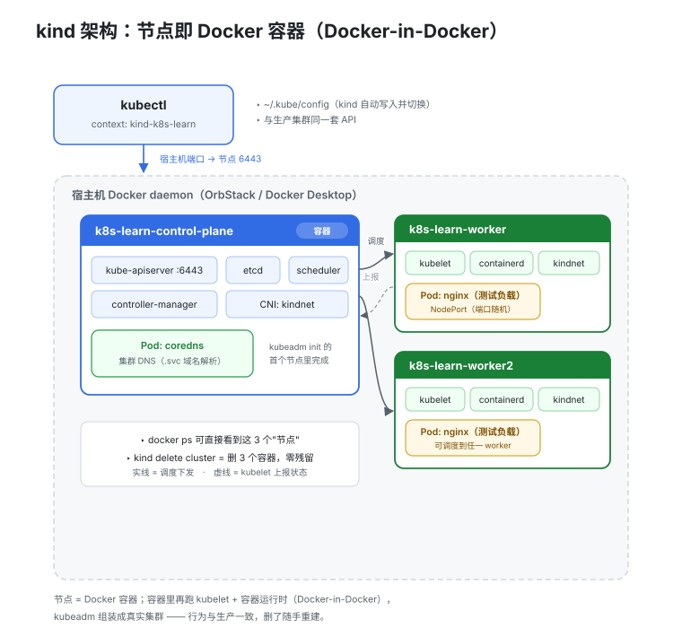

# 01 · 本地 Kubernetes 环境搭建：kind

> 本实验是整个系列的底座：用 kind 在本机 Docker 里拉起一个 **1 控制面 + 2 工作节点**的真实 Kubernetes 集群，后续 30 个实验都跑在它上面。

## 1. 为什么是 kind

学 Kubernetes 最大的门槛不是概念，而是**环境**：云上集群要花钱，公司集群不敢乱搞。本地搭一套随时可删可重建的集群，错了就 `kind delete cluster` 重来，零成本——这是学习效率最高的路径。

本地 K8s 主流方案对比：

| 维度 | kind | minikube | k3s / k3d |
|------|------|----------|-----------|
| 实现方式 | Docker 容器当节点（kubeadm） | VM 或容器 | 轻量二进制 / 容器里装 k3s |
| 启动速度 | 快（3 节点约 1 分钟） | 慢（VM 开机） | 最快（约 30s） |
| 多节点 | 配置文件里多写几行 `role: worker` | `--nodes=N` | 支持 |
| 多集群并存 | `--name` 即可 | profile 机制 | 多实例 |
| 真实度 | 完整 kubeadm 集群 | 完整 | 裁剪版（默认 Flannel + Traefik，组件可裁可换） |
| 适用场景 | 学习 / CI / 多节点拓扑 | 单节点入门 | 边缘 / 低资源机器 |

**结论**：本系列用 kind——它就是 Kubernetes 官方跑自己 CI 的工具，多节点支持一行配置，行为与生产集群最接近。

## 2. 架构总览


> 🌐 **交互版**：[在线打开（GitHub Pages）](https://yong-huang.github.io/hands-on-kubernetes/labs/01_setup_env/images/kind_arch.html)（或本地打开 [`images/kind_arch.html`](images/kind_arch.html)）。

kubectl 通过 `~/.kube/config` 里的 context（`kind-k8s-learn`）连向宿主机 Docker daemon（OrbStack 或 Docker Desktop 均可）；daemon 里跑着 3 个容器——1 个 control-plane（apiserver / etcd / scheduler / controller-manager，外加 CoreDNS Pod）和 2 个 worker（kubelet + containerd + kindnet，里面跑 nginx 测试 Pod）。实线是调度下发，虚线是 kubelet 上报状态。

核心心智模型一句话：**节点 = 容器**。`docker ps` 能直接看到这 3 个"节点"；`kind delete cluster` 就是删 3 个容器，零残留，删了随手重建。

`setup.sh` 怎么把这个集群搭出来？六步流程图见 [§4 六步拆解](#4-六步拆解)开头。

## 3. 快速开始

```bash
# 前置：docker / kubectl / kind 已安装（没有的话先跑 labs/00_setup_kind/setup_kind.sh）
./setup.sh up        # 六步一条龙：建集群 -> 验证 -> 预载镜像 -> 部署 nginx
kubectl get nodes    # 3 个节点 Ready 即成功
kubectl get pods,svc -l app=nginx   # 测试负载已就绪
./setup.sh down      # 删集群（所有实验做完再来跑这句）
```

访问测试 Service：`kubectl port-forward svc/nginx 8080:80`，浏览器打开 `http://localhost:8080`。

## 4. 六步拆解


> 🌐 **交互版**：[在线打开（GitHub Pages）](https://yong-huang.github.io/hands-on-kubernetes/labs/01_setup_env/images/setup_flow.html)（或本地打开 [`images/setup_flow.html`](images/setup_flow.html)）。

六个步骤：检查依赖 → 生成配置 → 创建集群 → 验证 → 预载镜像（国内网络适配，黄色）→ 部署测试负载（绿色）。逐步看关键代码：

### Step 1: 前置检查

```bash
for cmd in docker kubectl kind; do
    command -v "${cmd}" >/dev/null 2>&1 || { echo "missing ${cmd}"; exit 1; }
done
docker info >/dev/null 2>&1 || { echo "Docker daemon not running"; exit 1; }
```

kind 硬依赖 Docker daemon（节点就是容器）；用 `docker info` 而不是 `docker version` 探活，因为它真正反映 daemon 是否可用。脚本整体跑在 `set -euo pipefail` 下，任何一步失败立刻退出，不带着错误往下走。

### Step 2: 生成集群配置（heredoc）

```yaml
kind: Cluster
apiVersion: kind.x-k8s.io/v1alpha4
name: k8s-learn
nodes:
  - role: control-plane   # 1 个控制面节点
  - role: worker          # 2 个工作节点
  - role: worker
```

多节点只是**多写几行 `role: worker`**——这是 kind 相对 minikube 最大的便利。生产集群 control-plane 与 worker 角色分离（控制面节点不跑业务 Pod），本地用 kind 可以真实复现这种拓扑，后面实验里的调度、拓扑打散、节点维护才有戏可演。

### Step 3: 创建集群 + 切换 context

```bash
kind create cluster --config manifests/kind-config.yaml --wait 120s
kubectl config use-context kind-k8s-learn
```

`--wait 120s` 让命令阻塞到控制面 Ready 才返回，后面的 kubectl 不会打空。kind 内部依次做了：拉节点镜像 → 启动 3 个容器 → 第一个容器里 `kubeadm init` → 其余 `kubeadm join` → 装默认 CNI（kindnet）→ 写 kubeconfig 并切换 context。

脚本在创建前会先 `kind delete` 同名集群，保证可重复执行——这也是本系列脚本的通用约定。

### Step 4: 验证

```bash
kubectl get nodes -o wide
kubectl cluster-info
kubectl wait --for=condition=Ready nodes --all --timeout=180s
```

`kubectl wait` 是比 `sleep` 优雅得多的等待原语：轮询直到条件满足，满足即返回，不浪费一秒。

### Step 5: 预载测试镜像（国内网络适配）

```bash
docker pull docker.m.daocloud.io/library/nginx:alpine
docker tag  docker.m.daocloud.io/library/nginx:alpine nginx:alpine
docker save nginx:alpine | docker exec --privileged -i <node> ctr --namespace=k8s.io images import -
```

kind 节点内直连 registry-1.docker.io 会 TLS 超时（国内网络）。绕法：宿主机从镜像源拉取 → `docker save` + `ctr images import` 灌进每个节点。非 latest 标签的 `imagePullPolicy` 默认 IfNotPresent，节点里有镜像就不会再去拉。

两点细节：

- 没用 `kind load docker-image`，是因为它对部分镜像源导出的 manifest 会报 digest not found，`ctr images import` 最稳。
- 全系列通用的预载脚本在仓库根：`scripts/load_images.sh`（带默认镜像列表，也可 `./load_images.sh img1 img2` 自定义）。本实验脚本内联了单镜像版本，方便看清原理。

### Step 6: 部署测试负载

```bash
kubectl create deployment nginx --image=nginx:alpine
kubectl expose deployment nginx --port=80 --type=NodePort
kubectl rollout status deployment/nginx --timeout=120s
```

一条龙跑通 Deployment → Pod → Service。Pod 能调度到 worker 节点并 Ready，说明整个数据面（kubelet + containerd + kindnet）工作正常——集群不只是"起来了"，而是"能用了"。

### 清理

```bash
kind delete cluster --name k8s-learn   # 等价 ./setup.sh down
```

## 5. 文件结构

```
01_setup_env/
├── README.md                 # 本文档
├── setup.sh                  # 一键脚本: up / down / load
├── manifests/
│   └── kind-config.yaml      # 集群拓扑: 1 control-plane + 2 worker（脚本每次会重新生成）
└── images/
    ├── kind_arch.architecture.json          # 图源（Archify Typed JSON IR）
    ├── kind_arch.html        # 交互版（浏览器打开）
    └── kind_arch.svg          # 双主题矢量版         
    ├── setup_flow.workflow.json          # 图源（Archify Typed JSON IR）
    ├── setup_flow.html        # 交互版（浏览器打开）
    └── setup_flow.svg          # 双主题矢量版        
```

## 6. 常见问题

**Q1: kind 和 minikube 怎么选？**
kind 节点是 Docker 容器，启动快、CI 友好（K8s 官方 CI 在用）、多节点一行配置；minikube 默认 VM 隔离更彻底（可模拟多 OS），但重且慢。本地学习/测试多节点拓扑选 kind；需要 VM 级隔离或 addons 生态（`minikube addons`）选 minikube。

**Q2: 多套集群如何管理？**
kubeconfig 中一个集群对应一个 context。`kind create cluster --name a` / `--name b` 可并存，`kubectl config use-context` 切换；生产上常用 `kubectx` 工具，或用 `KUBECONFIG` 环境变量把不同环境的配置文件彻底分开。

**Q3: 集群创建失败的常见原因？**
① Docker daemon 未运行或版本过旧；② 拉节点镜像超时（国内网络，可给 kind 配镜像源或 `kind load` 预载节点镜像）；③ 端口冲突/残留同名集群——先 `kind delete cluster`；④ Docker 虚拟机内存给太小（3 节点建议 ≥4GB，Docker Desktop 在 Settings → Resources 调整，OrbStack 一般默认够用）；⑤ 代理劫持了 127.0.0.1 上的 API 端口。

**Q4: 为什么 Pod 一直 Pending？**
通常是没装 CNI 或资源不足。kind 默认装 kindnet；若配置了 `disableDefaultCNI: true` 需手动装 Calico/Flannel。`kubectl describe node` 看 Conditions、Taints 和容量即可定位。

**Q5: kind 里怎么访问 Service？**
NodePort 也无法直接从宿主机访问（节点在容器网络里，端口没映射到宿主机）。方案：`kubectl port-forward`（最简单，本实验用的就是它）、在 kind-config 里配 `extraPortMappings` 把宿主机端口映射到节点、或装 Ingress（kind 官方提供 ingress-ready 的节点镜像）。

## 7. 总结

- kind = Docker 容器当节点的真实 kubeadm 集群，官方 CI 同款，学习/CI 首选
- 多节点拓扑只是配置文件里多几行 `role: worker`；多集群本质是 kubeconfig 里的多个 context
- `set -euo pipefail` + 函数分步 + `kubectl wait`，让脚本可重复执行、失败即停
- 国内网络的镜像问题用"镜像源拉取 + `ctr import` 灌节点"统一解决，全系列复用 `scripts/load_images.sh`
- 环境搭好只是起点：后续实验从 Pod 出发，逐层深入 Deployment / Service / 存储与生态组件
