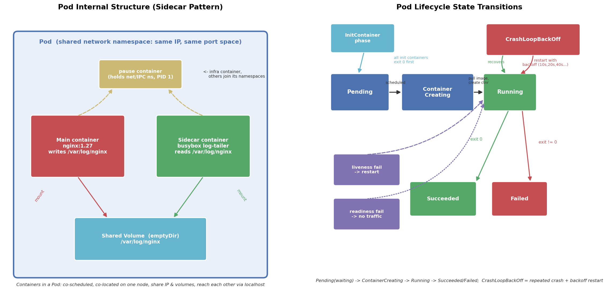

# 02 · Pod：Kubernetes 的最小调度单元

## 引言

刚从 Docker 转到 K8s 的人最容易问的一个问题是：**为什么 K8s 不直接调度容器，而要发明一个 Pod？**

答案是：容器虽然隔离性好，但现实中的应用经常是"一组功能互补的进程"——主进程 + 日志收集 + 配置下发 + 网络代理。这些进程需要共享磁盘、用 `localhost` 互相通信、生命周期绑定在一起。Linux 里早就有这种分组思想（进程组），Pod 就是把它搬到了容器世界：

> **Pod 是一组共享网络命名空间和存储卷的容器，它们同生共死、被调度到同一个节点上，是 K8s 最小的调度与部署单元。**

K8s 不会单独调度某个容器，调度的原子单位永远是 Pod。

## 文件结构

```
02_pod/
├── README.md    # 本文档
├── pod.sh      # 实操脚本：apply → describe → log → exec → label → 清理
├── manifests/
│   └── pod.yaml    # 4 个 Pod 示例：单容器 / sidecar / initContainer / 探针
├── scripts/
│   └── gen_arch.py        # 架构图生成脚本 (python3 scripts/gen_arch.py)
└── images/
       └── pod_arch.png
```

## 核心概念

### 1. pause 容器（infrastructure container）

每个 Pod 底层其实都有一个用户看不见的 `pause` 容器，它最先启动，作用是**持有 Pod 的网络命名空间（和 IPC 命名空间）**。其余业务容器都加入 pause 的命名空间，因此：

- 同一个 Pod 里所有容器共享同一个 IP、同一套端口空间
- 容器之间用 `localhost` 互访（不同容器不能用同一个端口）
- 主容器崩溃重启，Pod IP 不变（是 pause 在撑着网络）

pause 平时几乎不消耗资源，它的存在解释了 `kubectl get pod` 里看到的容器和节点上 `docker ps` 看到的容器"多一个"的现象。

### 2. sidecar vs initContainer

两者都是"在主容器之外附加容器"，但用法完全不同：

| | initContainer | sidecar |
|---|---|---|
| 执行时机 | 主容器启动**之前** | 与主容器**同时**运行 |
| 执行方式 | 串行，逐个执行 | 并行，长期运行 |
| 成功条件 | 必须 `exit 0` 才继续 | 无退出概念，跟随 Pod 生命周期 |
| 典型用途 | 等待依赖就绪、下载模型、初始化配置 | 日志收集、网络代理（Istio envoy）、数据同步 |

本项目的 `nginx-sidecar-pod` 演示了经典 sidecar：nginx 写日志到共享卷，busybox `tail -f` 实时读取，二者通过 `emptyDir` 卷看到同一份文件。

### 3. 三种探针：startup / liveness / readiness

探针由 kubelet 周期性执行，类型可以是 `httpGet`、`tcpSocket` 或 `exec`：

| 探针 | 失败后果 | 解决什么问题 |
|---|---|---|
| **livenessProbe** | **重启容器** | 应用卡死、死锁，进程活着但不工作 |
| **readinessProbe** | **从 Service endpoints 摘除流量**（不重启） | 应用活着但没准备好接流量（加载缓存、预热中） |
| **startupProbe** | 成功之前屏蔽上两个探针 | 慢启动应用被 liveness 误杀 |

一个记忆方法：liveness 治"病"，readiness 治"没长大"，startup 治"慢热"。

## YAML 关键字段讲解

```yaml
metadata:
  labels:            # 标签是 K8s 一切"找 Pod"机制的基础
    app: nginx       # Service/Deployment 通过 selector 匹配
spec:
  containers:
    - resources:
        requests:    # 调度依据：节点剩余资源 >= requests 才会被调度上去
          cpu: 100m  # 100m = 0.1 核
        limits:      # 运行上限：内存超限 → OOMKilled；CPU 超限 → 限流不杀
          memory: 256Mi
  volumes:
    - name: shared-logs
      emptyDir: {}   # Pod 级临时卷，Pod 删除即消失，常用于容器间共享
```

几个容易踩的点：

- **requests 与 limits 不一致的行为差异**：CPU 超限只是被 throttle（响应变慢），内存超限是直接 OOMKill（`RESTARTS` 增加且 `Last State: OOMKilled`）。
- **`containerPort` 只是声明**，不写端口也照样能通，它服务于文档和 Service 的 targetPort 提示。
- **探针参数**：`failureThreshold × periodSeconds` = 判定失败的最长容忍时间。示例里 startup 的 `30 × 2s = 60s`，给慢启动应用留了 1 分钟。

## 常用 kubectl 命令表

| 命令 | 作用 |
|---|---|
| `kubectl apply -f manifests/pod.yaml` | 创建/更新资源 |
| `kubectl get pods -o wide` | 查看状态（含 IP、所在节点） |
| `kubectl get pods --show-labels` | 查看标签 |
| `kubectl get pods -l app=nginx` | 按标签筛选 |
| `kubectl label pod nginx-pod env=demo` | 打标签（`--overwrite` 覆盖） |
| `kubectl describe pod <name>` | 详情 + Events，排查第一站 |
| `kubectl logs <pod> [-c 容器名] [-f]` | 看日志；多容器 Pod 必须指定 `-c` |
| `kubectl exec -it <pod> -- sh` | 进入容器 |
| `kubectl exec <pod> -- nginx -v` | 容器内执行单条命令 |
| `kubectl delete -f manifests/pod.yaml` | 按清单清理 |
| `kubectl get pod <p> -o jsonpath=...` | 提取特定字段（restartCount 等） |

## 可视化



左图是 Pod 的内部结构：pause 容器持有网络命名空间，nginx 主容器与 busybox sidecar 通过共享卷（emptyDir）交换日志。右图是生命周期状态机：从 Pending、ContainerCreating 到 Running，以及 CrashLoopBackOff 的退避重启循环。

## 面试要点

**Q1: Pod 和容器的区别？**
容器是运行单元，Pod 是调度单元。一个 Pod 可包含多个共享网络/存储的容器，K8s 保证它们同节点部署、同生命周期。Pod 底层由 pause 容器持有命名空间，所以同 Pod 容器可用 `localhost` 互访。

**Q2: initContainer 和 sidecar 的区别？**
initContainer 在主容器前**串行**执行且必须成功退出，做一次性初始化；sidecar 与主容器**并行长期**运行，提供辅助能力（日志、代理）。一个管"出生前的准备"，一个管"一生中的陪伴"。

**Q3: liveness 和 readiness 的区别？**
liveness 失败 → kubelet **重启容器**；readiness 失败 → 只从 Service **摘除流量**，容器不重启。readiness 用于发布摘流、liveness 用于自愈。还有 startupProbe 保护慢启动应用。

**Q4: CrashLoopBackOff 怎么排查？**
CrashLoopBackOff = 容器反复崩溃，kubelet 按指数退避（10s、20s、40s…上限 5min）重启。排查步骤：
1. `kubectl logs <pod> --previous` 看上一次崩溃的日志（最关键）
2. `kubectl describe pod` 看 `Last State`：`OOMKilled` → 调大 memory limits；`Error/Crash` → 应用自身问题
3. 检查 command/args 是否写错导致进程立即退出
4. 检查 liveness 探针是否配得太严（initialDelaySeconds 太短、端口/路径错误）导致"启动慢被杀"

## 总结

Pod 的设计哲学是"**一组亲缘容器 = 一个调度原子**"：pause 容器提供共享底座，sidecar 和 initContainer 扩展主容器的能力边界，探针则赋予 Pod 自愈与流量治理的能力。理解了 Pod，Deployment、Service、StatefulSet 都只是"管理 Pod 的不同方式"而已。

下一节：Deployment —— 让多副本、滚动更新、自愈从 YAML 一键获得。
