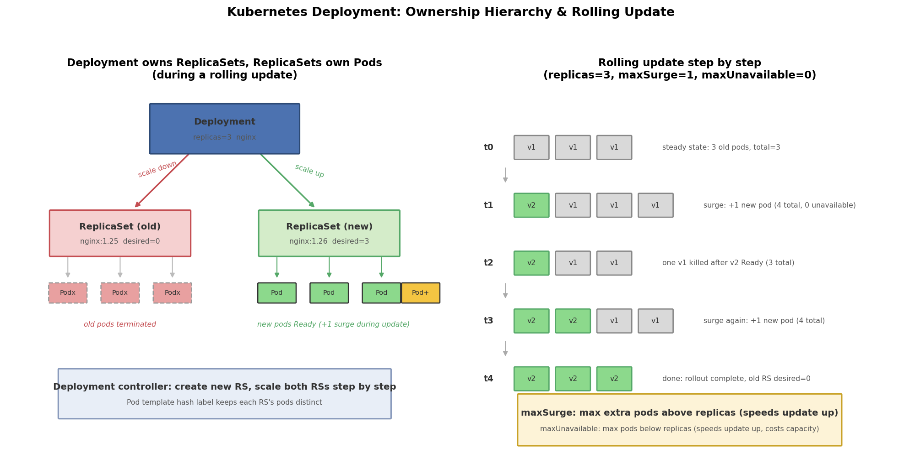

# Kubernetes Deployment 详解：自愈、扩缩容与滚动更新

## 引言

直接创建 Pod 有三个致命问题：节点宕机后 Pod 不会自动重建（无自愈）、流量高峰时无法快速加副本（无扩缩容）、升级镜像只能删旧建新、服务会中断（无滚动更新）。

Deployment 就是解决这三个问题的上层控制器。我们只需要声明"期望状态"（几个副本、用什么镜像），Deployment 控制器就会持续把实际状态向期望状态收敛：

- **自愈**：Pod 挂了自动重建，节点故障后在别的节点补齐副本
- **扩缩容**：改一个数字（replicas）即可水平伸缩
- **滚动更新与回滚**：逐个替换 Pod 完成升级，出问题一键回滚

## 文件结构

```
03_deploy/
├── README.md    # 本文档
├── deploy.sh      # 全流程演示脚本：apply/scale/update/rollback/pause/clean
├── manifests/
│   └── deploy.yaml    # 两个 Deployment 示例：RollingUpdate vs Recreate
├── scripts/
│   └── gen_arch.py        # 架构图生成脚本 (python3 scripts/gen_arch.py)
├── images/
│   └── deploy_arch.png # 架构与滚动更新示意图
```

## 核心概念

### Deployment → ReplicaSet → Pod 三层关系

Kubernetes 用三层 ownership（属主关系）管理无状态应用：

```
Deployment（应用版本管理：滚动更新、回滚）
├── README.md    # 本文档
├── scripts/
│   └── gen_arch.py        # 架构图生成脚本 (python3 scripts/gen_arch.py)
├── ReplicaSet（副本管理：保证 Pod 数量，每个版本一个 RS）
└── Pod（真正干活的实例）
```

- **Deployment 不直接管理 Pod**，而是通过修改 ReplicaSet 的副本数间接控制
- 每次修改 Pod 模板（镜像、环境变量等），Deployment 就**新建一个 ReplicaSet**，并把旧 RS 缩容到 0
- Pod 通过 `pod-template-hash` 标签区分自己属于哪个 RS

### RollingUpdate vs Recreate

| 策略 | 行为 | 服务中断 | 适用场景 |
|------|------|----------|----------|
| RollingUpdate（默认） | 新 RS 逐步扩容、旧 RS 逐步缩容 | 无 | 绝大多数无状态服务 |
| Recreate | 先杀掉全部旧 Pod，再创建新 Pod | 有 | 不允许多版本共存的应用（如旧新副本会争抢同一外部资源/数据卷） |

### rollout history / undo 的原理

Deployment 的"历史版本"就是那些**被缩容到 0 但没删除的旧 ReplicaSet**（保留数量由 `revisionHistoryLimit` 控制，默认 10）。每个 RS 对应一个 revision：

- `kubectl rollout history` 列出所有保留的 RS 修订版
- `kubectl rollout undo` 把上一个 RS 的 Pod 模板拷回 Deployment spec，再触发一次正常的滚动更新——**回滚本质上也是一次滚动更新**

## YAML 关键字段

```yaml
spec:
  replicas: 3                 # 期望副本数
  revisionHistoryLimit: 5     # 保留多少个旧 RS 供回滚
  minReadySeconds: 5          # Pod Ready 后至少活 5 秒才算"可用"
  strategy:
    type: RollingUpdate
    rollingUpdate:
      maxSurge: 1             # 最多超出期望副本数 1 个（先扩新再缩旧）
      maxUnavailable: 0       # 最多允许 0 个不可用（容量永不下降）
  selector:                   # 标签选择器，"认领"自己的 Pod，创建后不可改
    matchLabels:
      app: nginx-rolling
  template:                   # Pod 模板，改它 = 触发滚动更新
    ...
```

几个易踩的坑：

- **selector 创建后不可修改**，且必须匹配 `template.labels`
- `maxSurge` / `maxUnavailable` 可以写数字或百分比（默认 25%/25%），二者不能同时为 0
- `readinessProbe` 是滚动更新的安全阀：新 Pod 未 Ready 就不会有旧 Pod 被杀
- `resources.requests` 影响调度；没有 requests/limits 的 Pod 属于 BestEffort QoS，资源紧张时最先被驱逐

## 滚动更新过程详解

以 `replicas=3, maxSurge=1, maxUnavailable=0`，从 nginx:1.25 升到 nginx:1.26 为例：

```
t0: v1 v1 v1          稳态：3 个旧 Pod
t1: v2 v1 v1 v1       maxSurge=1：先多建 1 个新 Pod（总数 4）
t2: v2 v1 v1          新 Pod Ready 后，杀掉 1 个旧 Pod（总数 3）
t3: v2 v2 v1 v1       再 surge 1 个新 Pod（总数 4）……循环
t4: v2 v2 v2          完成：新 RS desired=3，旧 RS desired=0
```

- **maxSurge 越大更新越快**（并行度更高），但占用更多资源
- **maxUnavailable 越大更新越快**，但更新期间服务容量下降
- 极端配置 `maxSurge=0, maxUnavailable=1`：省资源但容量先降后升；`maxSurge=1, maxUnavailable=0`：容量永不下降但更新稍慢

常用操作命令：

```bash
kubectl rollout status deployment/nginx-rolling        # 盯着看发布进度
kubectl set image deployment/nginx-rolling nginx=nginx:1.26
kubectl rollout history deployment/nginx-rolling      # 查看修订版
kubectl rollout undo  deployment/nginx-rolling       # 回滚上一版
kubectl rollout undo  deployment/nginx-rolling --to-revision=2
kubectl rollout pause deployment/nginx-rolling      # 暂停（可累积多处改动）
kubectl rollout resume deployment/nginx-rolling     # 恢复后一次性发布
```

## 可视化

左图是滚动更新中的三层 ownership 结构（旧 RS 缩容到 0、新 RS 扩容到 3）；右图是 maxSurge=1 / maxUnavailable=0 时的逐步替换时间线：



## 面试要点

1. **滚动更新原理**：Deployment 不直接动 Pod；改模板 → 新建 RS → 控制循环按 maxSurge/maxUnavailable 约束同步地"扩新 RS、缩旧 RS"→ 旧 RS 保留在 0 副本供回滚。
2. **maxSurge / maxUnavailable 的作用**：控制更新速度与可用容量的折中。maxSurge 允许临时超额（多占资源），maxUnavailable 允许临时欠额（容量下降）；两者共同决定任意时刻新旧 Pod 总数的上下限 `[replicas - maxUnavailable, replicas + maxSurge]`。
3. **如何回滚**：`kubectl rollout undo`（或 `--to-revision=N`）。原理是把旧 RS 里的 Pod 模板拷回 Deployment，再正向执行一次滚动更新；能回滚的前提是旧 RS 未被删除（受 `revisionHistoryLimit` 控制）。
4. **Deployment 不能管理哪类工作负载**：有状态应用。Deployment 的 Pod 是无身份的（名字随机、可互相替换、无稳定存储和网络标识），有状态应用应该用 **StatefulSet**（稳定 hostname、有序启停、每副本独立 PV）；此外守护进程类用 DaemonSet、单次任务用 Job、常驻任务用 Deployment。

## 总结

Deployment = ReplicaSet + 版本管理。记住三层 ownership（Deployment→RS→Pod）和"改模板即触发滚动更新"这一条主线，maxSurge/maxUnavailable、revisionHistoryLimit、readinessProbe 都围绕它展开。配合 `deploy.sh` 里的 undo / pause / resume 演示，能直观感受到"声明式 API + 控制循环"的设计威力。
