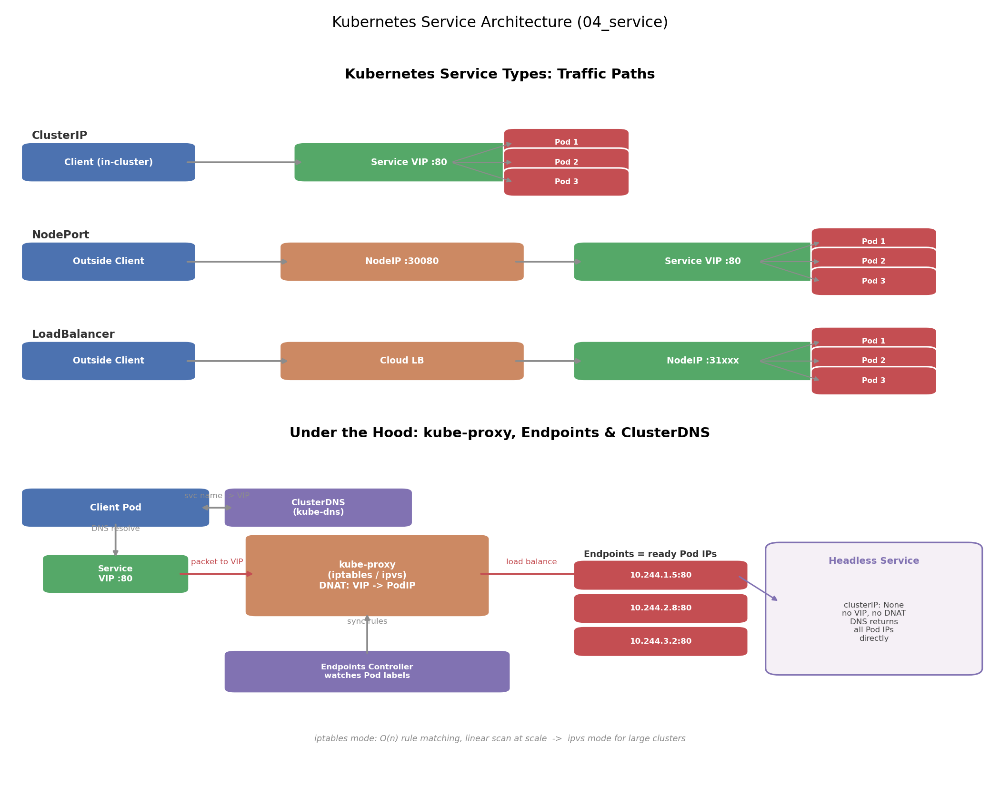

# 04 Service —— Kubernetes 服务发现与负载均衡

## 一、引言：为什么需要 Service？

Pod 是脆弱的。它可能被驱逐、被 OOM Kill、被滚动更新替换——每次重建都会拿到一个**新的 Pod IP**。如果其他服务直接硬编码 Pod IP：

- **Pod IP 易变**：滚动更新一次，所有调用方的配置全部失效；
- **一组 Pod 需要负载均衡**：Deployment 扩到 3 个副本，谁来把流量均匀分给它们？
- **服务发现**：调用方如何知道"现在有哪些健康的 Pod"？

Service 就是为了解决这三个问题的抽象：它提供一个**稳定的虚拟 IP（ClusterIP）+ DNS 名字**，并通过 label selector 自动追踪后端 Pod，实现负载均衡与服务发现。

## 二、文件结构

```
04_service/
├── README.md    # 本文档
├── service.sh      # 一键部署、验证访问、DNS 发现、Endpoints 检查、清理
├── manifests/
│   └── service.yaml    # Deployment + 4 种 Service（ClusterIP/NodePort/LoadBalancer/Headless）
├── scripts/
│   └── gen_arch.py        # 架构图生成脚本 (python3 scripts/gen_arch.py)
└── images/
       └── service_arch.png
```

## 三、核心概念

### 3.1 四种 Service 类型

| 类型 | 访问方式 | 适用场景 |
|---|---|---|
| **ClusterIP**（默认） | 集群内部通过 VIP:port | 微服务间互相调用 |
| **NodePort** | 外部通过 `<节点IP>:30000-32767` | 本地测试、无云 LB 环境 |
| **LoadBalancer** | 云厂商分配的外部 IP | 云上暴露服务（NodePort 超集） |
| **Headless**（clusterIP: None） | 无 VIP，DNS 直接返回 Pod IP | StatefulSet、gRPC 长连接、主从选举 |

三者的关系是**层层叠加**的：LoadBalancer ⊃ NodePort ⊃ ClusterIP。

### 3.2 selector → Endpoints 机制

Service 本身不直接"记住"Pod。流程是：

1. Service 的 `selector`（如 `app: nginx`）匹配 Pod 的 label；
2. **Endpoints Controller**（控制面组件）持续 watch Pod 变化，把所有 **Ready** 的 Pod IP:targetPort 写入同名的 Endpoints 对象；
3. Pod 挂掉 / 新建 → Endpoints 自动更新。

所以 `kubectl get endpoints <svc>` 是排查"Service 不通"的第一站：**Endpoints 为空 = selector 不匹配或 Pod 没 Ready**。

### 3.3 kube-proxy：VIP 的真正实现

ClusterIP 是一个**虚拟 IP**——没有任何网卡、任何进程监听它。它之所以能通，靠的是每个节点上的 **kube-proxy**：

- **iptables 模式**（默认）：为每个 Service 生成 DNAT 规则，把目标 VIP 的包直接改写为某个 Pod IP。请求路径上没有 proxy 进程，性能好；但规则是线性匹配，Service 数量大时（数千条规则）规则更新和匹配都变慢；
- **ipvs 模式**：内核级哈希表查找，O(1)，支持更多负载均衡算法（rr/lc/sh…），大规模集群首选。

### 3.4 ClusterDNS 服务发现

创建 Service 时，kube-dns（CoreDNS）自动注册一条记录：

```
<service-name>.<namespace>.svc.cluster.local
```

集群内任何 Pod 都可以直接用短名 `nginx-clusterip` 访问。Headless Service 的区别：DNS 查询**不返回 VIP**，而是返回所有 Ready Pod 的 IP 列表（A 记录），并且 StatefulSet 的每个 Pod 有独立 DNS：`<pod-ordinal>.<svc-name>`。

## 四、YAML 关键字段：port vs targetPort vs nodePort

最容易混淆的三个端口：

```yaml
ports:
  - port: 80          # Service 的端口 —— 集群内访问 nginx-svc:80 用的是它
    targetPort: 8080  # 容器（Pod）真正监听的端口 —— 转发的终点
    nodePort: 30080   # 节点上对外暴露的端口（仅 NodePort/LoadBalancer 有意义）
```

记忆方法：**port 是"门牌号"（对外），targetPort 是"房间号"（对内），nodePort 是"大楼侧门"（对集群外）**。targetPort 还可以填容器声明的端口名（如 `name: http`），这样改容器端口时无需改 Service。

## 五、可视化



上图展示了三种 Service 类型的流量路径对比（client → node → service → pods），以及内部机制：kube-proxy 通过 iptables/ipvs 做 DNAT，Endpoints Controller 维护健康 Pod IP 列表，ClusterDNS 完成 Service 名到 VIP（Headless 则直接到 Pod IP）的解析。

## 六、面试要点

**Q1：Service 如何找到 Pod？**
通过 `selector` 匹配 Pod label → Endpoints Controller 把 Ready Pod 的 IP:port 写入 Endpoints 对象 → kube-proxy 依据 Endpoints 在节点上同步转发规则。排查时先看 `kubectl get endpoints`。

**Q2：ClusterIP 是虚拟 IP，是什么意思？**
它不绑定任何网络设备，没有进程监听它。访问 VIP 的数据包在节点上被 iptables/ipvs 的 DNAT 规则直接改写为目的 Pod IP，因此 `ping ClusterIP` 不通、但 `curl ClusterIP:port` 通。

**Q3：NodePort 有什么性能问题？**
端口范围有限（默认 30000-32767）；流量经过 kube-proxy 的 NAT，多一跳；生产上直接暴露大量 NodePort 服务难以管理，通常用 LB 或 Ingress 收敛入口；同时它依赖节点 IP 的可达性，节点故障需要客户端自行切换。

**Q4：Headless Service 什么时候用？**
① StatefulSet：每个 Pod 需要稳定独立的 DNS 名（`pod-0.svc-name`）；② 客户端自己负载均衡（gRPC 长连接，避免 VIP 层 DNAT 打破连接粘性）；③ 需要直连特定实例的场景（主从数据库、Raft 选举）。

## 七、总结

- Service = 稳定入口（VIP + DNS）+ 动态后端（Endpoints）+ 流量分发（kube-proxy）；
- 类型递进：ClusterIP ⊂ NodePort ⊂ LoadBalancer，Headless 是"无入口"的反例；
- 三个端口各司其职：port 对外、targetPort 对内、nodePort 对节点外；
- 排查链路：`kubectl get svc` → `kubectl get endpoints` → `kubectl describe endpoints` → pod 内 curl。

下一节：05 ConfigMap & Secret——把配置和敏感信息从镜像里解耦出来。
