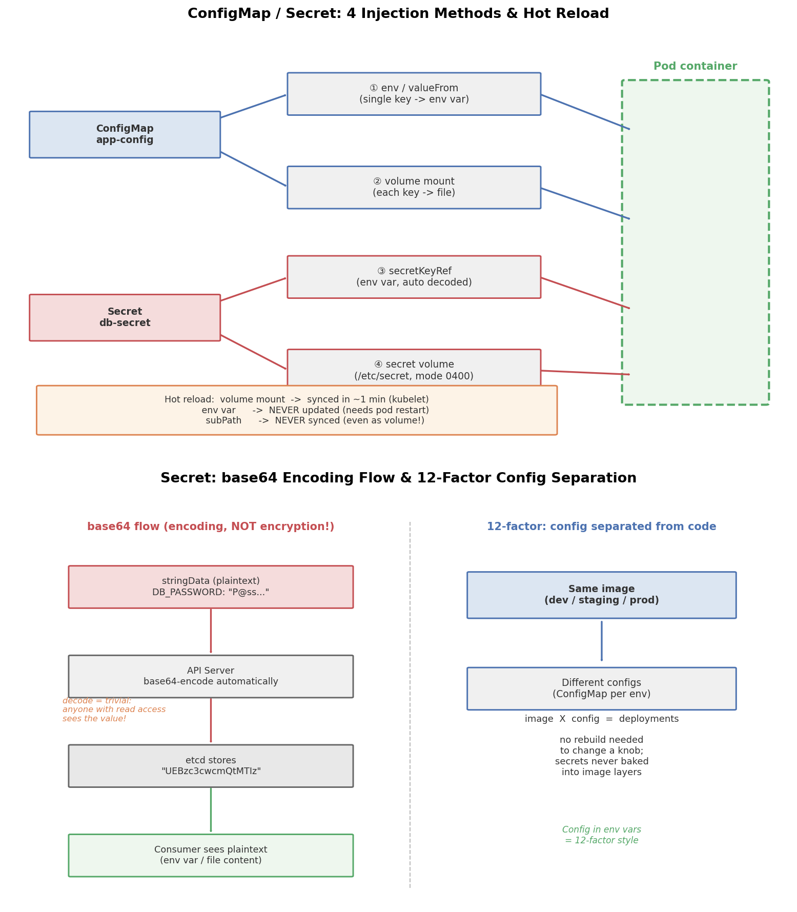

# Kubernetes 学习 05：ConfigMap 与 Secret —— 配置与代码分离

## 引言

为什么不能把配置写死在镜像里？

想象一个场景：你把数据库地址 `db-prod.internal`、日志级别 `info` 硬编码进了应用镜像。某天要上测试环境连 `db-test.internal`，就得重新打镜像；想临时把日志调成 `debug` 排查问题，又得再打一次镜像。镜像越打越多，环境之间的差异却越来越大，最后没人说得清"到底哪个镜像配哪个环境"。

这正是 [12-Factor 应用方法论](https://12factor.net/zh_cn/config) 第三条 "**在环境中存储配置**" 要解决的问题：

> 配置和代码严格分离。同一个镜像，配上不同的配置（ConfigMap / Secret），就能跑在 dev / staging / prod。

Kubernetes 提供了两个专门的对象来完成这件事：

- **ConfigMap**：非敏感配置（日志级别、端口号、nginx.conf）
- **Secret**：敏感配置（密码、Token、证书）

## 文件结构

```
05_cm_secret/
├── README.md    # 本文档
├── cm_secret.sh      # 命令行实战：create/验证/热更新/清理
├── manifests/
│   └── cm_secret.yaml    # 声明式示例：2 个 ConfigMap + 1 个 Secret + 1 个 Pod
├── scripts/
│   └── gen_arch.py        # 架构图生成脚本 (python3 scripts/gen_arch.py)
└── images/
       └── cm_secret_arch.png # 架构图（下文引用）
```

## 核心概念

### ConfigMap vs Secret：区别在哪？

| 维度 | ConfigMap | Secret |
|---|---|---|
| 用途 | 非敏感配置 | 敏感数据（密码/证书/Token） |
| 存储形式 | 明文字符串 | base64 编码 |
| 大小限制 | 1MB（etcd 限制） | 1MB |
| 挂载文件权限 | 默认 0644 | 可设 `defaultMode: 0400` |
| 类型 | 无 | Opaque / kubernetes.io/tls / dockerconfigjson 等 |

**最重要的认知：base64 不是加密！** `echo 'UEBzc3cwcmQtMTIz' | base64 -d` 任何人都能秒解。Secret 的"安全"来自配套设施：

1. **etcd 静态加密**：开启 `EncryptionConfiguration` 后，Secret 在 etcd 落盘前再加密一层
2. **RBAC**：`secrets` 是独立的资源类型，可以细粒度控制谁有 `get/read` 权限
3. **审计日志**：谁读了哪个 Secret 有迹可循
4. **不会进入镜像层**：密码永远不在镜像里，避免 `docker history` 泄露

### 四种注入方式

| 方式 | YAML 字段 | 特点 |
|---|---|---|
| ① ConfigMap 单键 env | `env[].valueFrom.configMapKeyRef` | 一个键 → 一个环境变量 |
| ② ConfigMap 卷挂载 | `volumes[].configMap` | 每个键变成挂载目录下的一个文件 |
| ③ Secret 单键 env | `env[].valueFrom.secretKeyRef` | base64 自动解码后注入 |
| ④ Secret 卷挂载 | `volumes[].secret` | 每键一个文件，内容是解码后的明文 |

另有一个偷懒写法 `envFrom`，把整个 ConfigMap/Secret 的所有键一次性变成环境变量——方便但有键名冲突风险。

### 热更新机制与 subPath 陷阱

kubelet 会周期性检查（默认约 1 分钟）被挂载的 ConfigMap/Secret，如果内容变了，就更新挂载目录（实际是原子替换符号链接）：

- **volume 挂载**：会热更新（但应用是否重新读文件是应用自己的事）
- **env 注入**：**永不更新**——环境变量在容器启动时就固定了，改了 ConfigMap 也无济于事，必须重启 Pod
- **subPath 挂载**：**永不更新**——这是最经典的陷阱！如果你只想挂载一个文件：

  ```yaml
  volumeMounts:
    - name: config-volume
      mountPath: /etc/nginx/nginx.conf   # 挂的是文件而不是目录
      subPath: nginx.conf
  ```

  这种写法 kubelet 不会同步更新，即使底层 ConfigMap 变了。想要"只挂一个文件且能热更新"，通常改用挂载整个目录 + 符号链接，或用 reload 容器/Reloader 之类的方案。

## YAML 关键字段

```yaml
# Secret 用 stringData 免手动 base64：
stringData:
  DB_PASSWORD: "P@ssw0rd-123"   # API Server 自动编码存 etcd

# 单键注入环境变量：
env:
  - name: DB_PASSWORD
    valueFrom:
      secretKeyRef:
        name: db-secret
        key: DB_PASSWORD

# 卷挂载 + 权限收紧：
volumes:
  - name: secret-volume
    secret:
      secretName: db-secret
      defaultMode: 0400          # 只有 owner 可读，适合密码文件
```

## 可视化



上图两个面板分别展示了：

1. **四种注入方式与热更新行为**：ConfigMap（蓝色）与 Secret（红色）各自通过 env / volume 两条路径进入容器；底部标注了热更新规则——volume 约 1 分钟同步、env 永不更新、subPath 永不同步。
2. **base64 编码流程与 12-Factor 原则**：明文 `stringData` → API Server 自动 base64 → etcd 存储 → 消费端自动解码；右侧强调"同一镜像 × 不同配置 = 多环境部署"。

## 面试要点

1. **Secret 到底安全吗？** base64 只是编码不是加密。真正的安全性靠：etcd 静态加密（`EncryptionConfiguration`）、RBAC 权限控制、审计日志。默认安装下 Secret 在 etcd 里就是 base64 裸奔，生产集群必须开启加密。
2. **ConfigMap 大小限制 1MB**：这是 etcd 的限制。大配置（如几百 KB 的 JSON）应拆分，或干脆放到对象存储/配置中心里，ConfigMap 只存引用地址。
3. **subPath 不热更新**：面试高频陷阱题。答案：subPath 挂载是解析成绑定挂载，kubelet 的同步机制只作用于挂载点目录，不追踪 subPath 文件。
4. **immutable 不可变配置**：`immutable: true` 的 ConfigMap/Secret 无法被更新（只能删了重建）。好处：降低 kubelet watch 开销、防止意外误改、集群更安全。大规模集群（上万 ConfigMap）推荐开启。
5. **env vs volume 怎么选？** 较少变化的简单键值用 env（12-Factor 风格）；需要热更新或是完整配置文件用 volume；敏感凭据优先 Secret volume（可设 0400 权限）而不是 env（env 可能被日志/`/proc` 泄露）。

## 总结

- 配置与代码分离是 12-Factor 的核心实践，ConfigMap/Secret 让"一个镜像打天下"成为可能
- Secret 的 base64 **不是加密**，安全靠 etcd 加密 + RBAC + 审计的组合拳
- 四种注入方式（configMap env / configMap volume / secret env / secret volume）各有适用场景
- 热更新规则记三句话：**volume 会同步、env 不会、subPath 也不会**
- 生产建议：敏感配置走 Secret volume + `defaultMode: 0400`，大配置放配置中心，不变的配置加 `immutable: true`

下一篇：06 讲卷与持久化存储（Volume / PV / PVC）。
