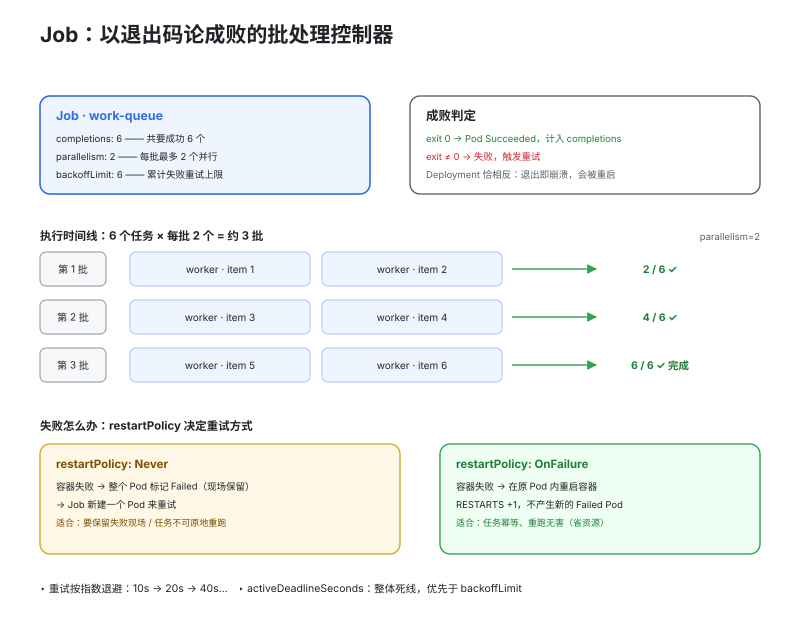

# 06 · Job 与 CronJob：会结束的工作

> Deployment 假设 Pod 应该永远活着，挂了就重建；但有一大类工作**天生要结束**——跑完就该退出，而且要"论成败"。Job / CronJob 就是为它们设计的。

## 1. 为什么 Deployment 干不了这活

批处理任务（转码 100 个视频、跑一次数据清洗）和定时任务（每小时备份、每天报表）用 Deployment 跑有两个致命问题：任务进程正常退出（exit 0）会被当成"崩溃"，Deployment 无脑重启容器，任务陷入死循环；且没有"成功/失败"的概念——副本数永远是 3，但你永远不知道任务跑完没有。

- **Job**：创建一个或多个 Pod，保证指定数量的 Pod **成功结束**（exit 0）
- **CronJob**：按 cron 表达式周期性地创建 Job——真正干活的还是 Job，它只是调度器

## 2. 快速开始

```bash
./job_cronjob.sh apply      # 一次性 Job（算 pi）+ 工作队列 Job + CronJob 定时备份
./job_cronjob.sh parallel   # 观察 work-queue：completions=6 × parallelism=2 分批跑
./job_cronjob.sh cronjob    # 手动触发一次 CronJob：kubectl create job --from=...
./job_cronjob.sh failure    # 必失败 Job：观察 backoff 与最终 Failed
./job_cronjob.sh suspend    # 挂起 / 恢复 CronJob
./job_cronjob.sh clean
```

## 3. Job：completions × parallelism 的矩阵


> 🌐 **交互版**：[在线打开（GitHub Pages）](https://yong-huang.github.io/hands-on-kubernetes/labs/06_job_cronjob/images/job_completions.html)（或本地打开 [`images/job_completions.html`](images/job_completions.html)）。

Job 的核心语义是"**保证 N 个 Pod 成功结束**"，由三个字段共同决定：

| 字段 | 含义 | 示例 |
|------|------|------|
| `completions` | 需要成功完成的 Pod 总数（总任务量） | 6 = 一共要跑成 6 个 |
| `parallelism` | 同一时刻最多并行的 Pod 数（并发度） | 2 = 每批最多 2 个同时跑 |
| `backoffLimit` | 累计失败重试上限，超过则 Job 标记 Failed | 4 = 最多容忍 4 个失败 Pod |

三种典型组合：

- **completions=1, parallelism=1**：最简单的一次性任务（本例 pi）
- **completions=N, parallelism=M**：工作队列模式，N 个任务 M 个 worker 分批消费（本例 work-queue）
- **不写 completions, 只写 parallelism=N**：只保证"成功 1 个"，N 个并行赛跑，谁先成功谁定结果（并行求解/竞速）

重试按**指数退避**（10s → 20s → 40s…）；`activeDeadlineSeconds` 给 Job 整体设"死线"，超时强制终止——它优先于 backoffLimit，任务可能还没重试完就被判超时。

### restartPolicy：Never vs OnFailure

Job 的 Pod 模板里 `restartPolicy` 只允许 `Never` 或 `OnFailure`（Deployment 默认的 `Always` 对 Job 非法），失败处理路径完全不同（对照上图下半部分）：

- **Never**：容器一失败，整个 Pod 标记 Failed，**Job 新建一个 Pod** 重试；失败 Pod 保留现场，方便 `kubectl describe` 排查
- **OnFailure**：**在同一个 Pod 里重启容器**，RESTARTS +1，不产生新的 Failed Pod

经验法则：任务**可重入/幂等**用 OnFailure 省资源；想**保留失败现场**（core dump、错误日志）或不可安全原地重跑，用 Never。

## 4. CronJob：schedule 与 concurrencyPolicy


> 🌐 **交互版**：[在线打开（GitHub Pages）](https://yong-huang.github.io/hands-on-kubernetes/labs/06_job_cronjob/images/cronjob_policy.html)（或本地打开 [`images/cronjob_policy.html`](images/cronjob_policy.html)）。

CronJob 每个调度周期（tick）按 `jobTemplate` 创建一个 Job。schedule 是标准五段 cron（分 时 日 月 周），注意**时区取决于控制器所在时区，通常 UTC**。

关键在 `concurrencyPolicy`——上一次的 Job 还没跑完，新调度点又到了怎么办：

| 策略 | 行为 | 适用场景 |
|------|------|----------|
| Allow（默认） | 新旧 Job 并发执行 | 任务轻量、互不干扰 |
| Forbid | 跳过本次调度 | 任务可能耗时超过周期（如备份），绝不允许重叠 |
| Replace | 杀掉正在跑的旧 Job，用新的替代 | 只关心最新一次结果 |

配套字段：`startingDeadlineSeconds` 决定"错过调度点多久内还能补启动"（控制器宕机恢复后可能连错好几个 tick，超期直接跳过）；`successfulJobsHistoryLimit` / `failedJobsHistoryLimit` 控制保留多少历史 Job 供查日志。

## 5. YAML 关键字段

```yaml
# Job 侧：
spec:
  completions: 6              # 需要成功完成的 Pod 总数
  parallelism: 2              # 同时最多 2 个 Pod 并行
  backoffLimit: 6             # 累计 6 次失败后放弃, Job -> Failed
  activeDeadlineSeconds: 300  # 整体超时死线, 优先于重试
  template:
    spec:
      restartPolicy: Never    # 只能是 Never / OnFailure, 不能用 Always

# CronJob 侧：
spec:
  schedule: "0 * * * *"           # 每小时整点 (时区通常为 UTC)
  concurrencyPolicy: Forbid       # 上一轮没跑完则跳过本次
  startingDeadlineSeconds: 300    # 错过调度点 300 秒内可补启动
  successfulJobsHistoryLimit: 3   # 保留最近 3 个成功 Job
  failedJobsHistoryLimit: 1       # 保留最近 1 个失败 Job
  suspend: false                  # true = 暂停后续所有调度
  jobTemplate:                    # 每次 tick 按此模板创建 Job
    spec: { ... }                 # 结构与普通 Job 的 spec 相同
```

易踩的坑：

- Job 的 Pod **退出码 0 才算成功**；exit 非 0 都会触发重试
- `kubectl scale job` 只能临时调大 parallelism，**不能改 completions**
- Job 完成后 Pod 默认保留（可看日志），但 Job 对象堆积会占用 etcd——用 `ttlSecondsAfterFinished` 或历史上限清理
- CronJob 的 tick 是分钟级精度，控制器恢复后可能**连续补跑**错过的 tick，任务必须幂等

## 6. 文件结构

```
06_job_cronjob/
├── README.md                  # 本文档
├── job_cronjob.sh             # 全流程演示：apply/parallel/cronjob/failure/suspend/clean
├── manifests/
│   └── job_cronjob.yaml       # 三个示例：一次性 Job / 并行 Job / CronJob 定时备份
└── images/
    ├── job_completions.workflow.json          # 图源（Typed JSON IR）
    ├── job_completions.html        # 交互版（浏览器打开）
    └── job_completions.svg          # 双主题矢量版    
    ├── cronjob_policy.workflow.json          # 图源（Typed JSON IR）
    ├── cronjob_policy.html        # 交互版（浏览器打开）
    └── cronjob_policy.svg          # 双主题矢量版     
```

## 7. 面试要点

1. **Job vs CronJob vs Deployment**：分别对应"跑完即退的一次性任务"、"按 cron 周期触发的任务"、"永不结束的常驻服务"。判断标准是生命周期：会结束且要追踪成败用 Job；周期性触发用 CronJob；要自愈和持续可用用 Deployment。有状态用 StatefulSet，每节点一个用 DaemonSet。
2. **Never vs OnFailure 对 Job 的影响**：Never 失败后 Pod 标 Failed、Job 新建 Pod 重试（保留现场）；OnFailure 在原 Pod 内重启容器（省资源，现场被覆盖）。两者都受 backoffLimit 约束。Always 对 Job 非法——Job 的语义就是靠"Pod 结束"来判断成败的。
3. **CronJob 错过调度怎么办**：由 `startingDeadlineSeconds` 决定——期限内补跑（可能连补多次），超期跳过。补跑时若上一轮还在跑，按 `concurrencyPolicy` 处理。任务必须幂等，"至少一次触发"是常态。
4. **如何停止 CronJob**：不删对象，`suspend: true`——暂停后续调度但保留配置和历史，改回 false 恢复；已在运行的 Job 不受影响。临时手动触发一次用 `kubectl create job --from=cronjob/X`。

## 8. 总结

Job = "保证 N 个 Pod 成功结束"：completions（总量）× parallelism（并发）× backoffLimit（重试上限）；CronJob = Job 的定时调度器，核心问题是"上一轮没跑完怎么办"（concurrencyPolicy）和"错过的调度补不补"（startingDeadlineSeconds）。配合 `job_cronjob.sh` 的演示，直观体会"以退出码论成败"的批处理语义与 Deployment"以存活论成败"的服务语义的根本分野。
