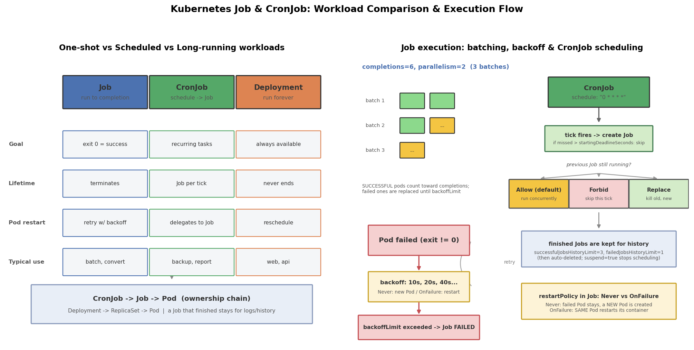

# Kubernetes Job & CronJob 详解：一次性任务与定时任务

## 引言

Deployment 的设计目标是"永不结束"——它假设 Pod 是一个应该无限存活的服务，挂了就重建，永远维持 N 个副本。但现实中有一大类工作恰恰相反，它们**天生要结束**：

- **批处理任务**：转码 100 个视频、跑一次数据清洗、计算一个结果——跑完就该退出
- **定时任务**：每小时备份数据库、每天凌晨生成报表、每周清理过期数据

用 Deployment 跑这类任务有两个致命问题：一是任务进程正常退出（exit 0）会被当成"崩溃"，Deployment 无脑重启容器，任务陷入死循环；二是没有"成功/失败"的概念——副本数永远是 3，但你永远不知道任务到底跑没跑完。

Job 和 CronJob 就是为"会结束的工作"设计的：

- **Job**：创建一个或多个 Pod，保证指定数量的 Pod **成功结束**（exit 0）
- **CronJob**：按 cron 表达式周期性地创建 Job

## 文件结构

```
06_job_cronjob/
├── README.md    # 本文档
├── job_cronjob.sh     # 全流程演示脚本: apply/parallel/cronjob/failure/suspend/clean
├── manifests/
│   └── job_cronjob.yaml   # 三个示例: 一次性 Job / 并行 Job / CronJob 定时备份
├── scripts/
│   └── gen_arch.py        # 架构图生成脚本 (python3 scripts/gen_arch.py)
└── images/
       └── job_cronjob_arch.png # 工作负载对比与执行流程图
```

## 核心概念

### Job：completions × parallelism 的矩阵

Job 的核心语义是"**保证 N 个 Pod 成功结束**"，由三个字段共同决定：

| 字段 | 含义 | 示例 |
|------|------|------|
| `completions` | 需要成功完成的 Pod 总数（总任务量） | 6 = 一共要跑成 6 个 |
| `parallelism` | 同一时刻最多并行的 Pod 数（并发度） | 2 = 每批最多 2 个同时跑 |
| `backoffLimit` | 累计失败重试上限，超过则 Job 标记 Failed | 4 = 最多容忍 4 个失败 Pod |

三种典型组合：

- **completions=1, parallelism=1**：最简单的一次性任务（本文 pi 例子）
- **completions=N, parallelism=M**：工作队列模式，N 个任务 M 个 worker 分批消费
- **不写 completions, 只写 parallelism=N**：只保证"成功 1 个"，但允许 N 个并行赛跑，谁先成功谁定结果（常用于并行求解/竞速场景）

重试采用**指数退避**（10s → 20s → 40s ...），避免故障任务打爆集群。还有 `activeDeadlineSeconds` 给 Job 整体设定"死线"，超时强制终止——它优先于 backoffLimit，即任务可能还没重试完就被判超时。

### CronJob：schedule 与 concurrencyPolicy

CronJob 每个调度周期（tick）按 `jobTemplate` 创建一个 Job。schedule 是标准五段 cron 表达式（分 时 日 月 周），注意**时区取决于控制器所在时区，通常是 UTC**。

关键在 `concurrencyPolicy`——如果上一次触发的 Job 还没跑完，新的调度点又到了怎么办：

| 策略 | 行为 | 适用场景 |
|------|------|----------|
| Allow（默认） | 新旧 Job 并发执行 | 任务轻量、互不干扰 |
| Forbid | 跳过本次调度 | 任务可能耗时超过周期（如备份），绝不允许重叠 |
| Replace | 杀掉正在跑的旧 Job，用新的替代 | 只关心最新一次结果的任务 |

配套字段：`startingDeadlineSeconds` 决定"错过调度点多久内还能补启动"（控制器宕机恢复后可能连错好几个 tick，超过期限的直接跳过）；`successfulJobsHistoryLimit` / `failedJobsHistoryLimit` 控制保留多少个历史 Job 供查日志，超出的自动删除。

### restartPolicy：Never vs OnFailure 的语义区别

Job 的 Pod 模板里 `restartPolicy` 只允许 `Never` 或 `OnFailure`（Deployment 默认的 `Always` 对 Job 是非法的），二者失败处理路径完全不同：

- **Never**：容器一失败，整个 Pod 标记 Failed，**Job 新建一个 Pod** 来重试。失败 Pod 会保留在现场，方便 `kubectl describe` 排查
- **OnFailure**：**在同一个 Pod 里重启容器**，退出码和重启计数记在容器上，不产生新的 Failed Pod

经验法则：任务**可重入/幂等**（重跑无害）用 OnFailure 省资源；想**保留失败现场**（如 core dump、错误日志）或任务不可安全原地重跑，用 Never。

## YAML 关键字段

```yaml
spec:
  completions: 6              # 需要成功完成的 Pod 总数
  parallelism: 2              # 同时最多 2 个 Pod 并行
  backoffLimit: 6             # 累计 6 次失败后放弃, Job -> Failed
  activeDeadlineSeconds: 300  # 整体超时死线, 优先于重试
  template:
    spec:
      restartPolicy: Never    # 只能是 Never / OnFailure, 不能用 Always
```

CronJob 侧：

```yaml
spec:
  schedule: "0 * * * *"           # 每小时整点 (时区通常为 UTC)
  concurrencyPolicy: Forbid       # 上一轮没跑完则跳过本次
  startingDeadlineSeconds: 300    # 错过调度点 300 秒内可补启动
  successfulJobsHistoryLimit: 3   # 保留最近 3 个成功 Job
  failedJobsHistoryLimit: 1       # 保留最近 1 个失败 Job
  suspend: false                  # true = 暂停后续所有调度
  jobTemplate:                    # 每次 tick 按此模板创建 Job
    spec: { ... }                 # 结构与普通 Job 的 spec 相同
```

几个易踩的坑：

- Job 的 Pod **退出码 0 才算成功**；exit 非 0 都会触发重试
- `kubectl scale job` 只能临时调大 parallelism，**不能改 completions**
- Job 完成后 Pod 默认保留（可看日志），但 Job 对象堆积会占用 etcd，记得用 TTL 控制器（`ttlSecondsAfterFinished`）或历史上限清理
- CronJob 的 tick 精度是分钟级，且控制器恢复后可能**连续补跑**错过的多个 tick（受 startingDeadlineSeconds 约束），任务必须幂等

## 可视化

左图对比三类工作负载（Job 一次性 / CronJob 周期性 / Deployment 常驻）的目标、生命周期与典型用途；右图是 Job 的执行流程：completions × parallelism 分批调度、失败后的 backoff 重试循环，以及 CronJob 触发时 concurrencyPolicy 的三条分支（Allow 并发 / Forbid 跳过 / Replace 替换）：



## 面试要点

1. **Job vs CronJob vs Deployment**：三者分别对应"跑完即退的一次性任务"、"按 cron 周期触发的任务"、"永不结束的常驻服务"。判断标准是任务的生命周期：会结束且要追踪成功与否用 Job；周期性触发用 CronJob（CronJob 只是 Job 的调度器，真正干活的是它创建的 Job）；需要自愈和持续可用用 Deployment。有状态用 StatefulSet，每节点一个用 DaemonSet。
2. **Never vs OnFailure 对 Job 的影响**：Never 失败后 Pod 标记 Failed、Job 新建 Pod 重试（保留失败现场）；OnFailure 在原 Pod 内重启容器（省资源，但现场被覆盖）。两者都受 backoffLimit 约束，累计失败够次数 Job 即 Failed。Always 对 Job 非法——因为 Job 的语义就是靠"Pod 结束"来判断成败的。
3. **CronJob 错过调度怎么办**：由 `startingDeadlineSeconds` 决定——错过的 tick 在期限内会被补跑（控制器宕机重启后可能连补多次），超期则跳过。若补跑时上一轮 Job 还在跑，按 `concurrencyPolicy` 处理（Allow 并发 / Forbid 跳过 / Replace 顶替）。任务必须写成幂等的，因为"至少一次触发"是常态。
4. **如何停止 CronJob**：不删对象，`suspend: true`（`kubectl patch cronjob X -p '{"spec":{"suspend":true}}'`）——暂停后续调度但保留配置和历史，改回 false 即恢复；已在运行的 Job 不受影响。要停正在跑的 Job 直接 `kubectl delete job`；要彻底删 CronJob 才 `kubectl delete cronjob`。临时手动触发一次用 `kubectl create job --from=cronjob/X`。

## 总结

Job = "保证 N 个 Pod 成功结束"的控制器，核心参数是 completions（总量）、parallelism（并发）、backoffLimit（重试上限）；CronJob = Job 的定时调度器，核心问题是"上一轮没跑完怎么办"（concurrencyPolicy）和"错过的调度补不补"（startingDeadlineSeconds）。配合 `job_cronjob.sh` 里的一次性 Job、并行 Job、手动触发 CronJob 和必失败 Job 的演示，能直观体会"以退出码论成败"的批处理语义与 Deployment"以存活论成败"的服务语义的根本分野。
