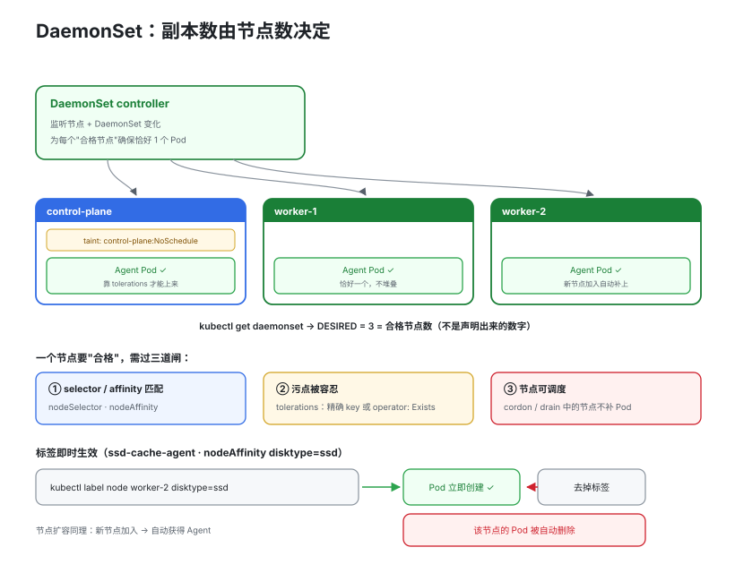

# 07 · DaemonSet：每个节点一个的守护进程

> 有一类负载不在意"总数"，而在意"覆盖面"——集群里每个节点都必须恰好跑一个。DaemonSet 的副本数不写死，**由节点数决定**。

## 1. 为什么副本数该由节点数决定

典型场景：日志采集（Fluent Bit / Filebeat 每节点一个 Agent）、节点监控（Node Exporter）、网络插件（CNI、kube-proxy 本质上也是每节点一份）。这类"节点级守护进程"用 Deployment 管理会出乱子：节点扩容后新节点没有 Agent，调度器还可能把两个 Agent 堆到同一个节点上。

## 2. 总览：调度模型


> 🌐 **交互版**：[在线打开（GitHub Pages）](https://yong-huang.github.io/hands-on-kubernetes/labs/07_daemonset/images/daemonset_scheduling.html)（或本地打开 [`images/daemonset_scheduling.html`](images/daemonset_scheduling.html)）。

DaemonSet 控制器（kube-controller-manager 内的 daemon pod controller）的逻辑：

1. 监听集群所有节点和 DaemonSet 的变化；
2. 对每个 DaemonSet，计算"应该有 Pod 的节点集合"——所有**匹配 selector/affinity、且可调度**的节点；
3. 节点上有 Pod 则保持，没有则创建；有两个则删多余的；
4. 节点被删除或 Pod 被驱逐时，在其他匹配节点上自动补齐。

所以 `kubectl get daemonset` 的 `DESIRED` 不是你声明的数字，而是**当前合格节点数**。集群从 3 节点扩到 5 节点，DESIRED 自动变 5，无需任何操作——这是与 Deployment 最本质的区别。

一句话主线：**desired 由节点数决定，覆盖面由 tolerations / nodeAffinity 决定，数据面靠 hostPath 触达节点本身。**

## 3. 快速开始

```bash
./daemonset.sh apply     # 部署两个 DaemonSet：日志采集（全节点）+ ssd-cache-agent（nodeAffinity）
./daemonset.sh dist      # -o wide 对比：节点数 vs Pod 数，每个节点名只出现一次
./daemonset.sh label     # 给节点打/摘 disktype=ssd 标签，看 Pod 即时增删
./daemonset.sh update    # 改镜像触发滚动更新（逐节点替换）
./daemonset.sh clean
```

## 4. tolerations / nodeAffinity：覆盖面的两道开关

### tolerations：为什么需要容忍度才能上控制面节点

控制面节点默认打有污点 `node-role.kubernetes.io/control-plane:NoSchedule`（"不许新 Pod 调度到我这"），以保护 etcd / API server 不被业务挤占。但日志、监控 Agent 需要**全覆盖**——控制面的日志同样要采集——所以要显式容忍：

```yaml
tolerations:
  - key: node-role.kubernetes.io/control-plane   # 精确容忍控制面污点
    effect: NoSchedule
  - operator: Exists                             # 容忍一切污点 (最强, 慎用)
    effect: NoExecute
```

指定 key 只容忍特定污点；`operator: Exists` 不限 key、容忍一切匹配 effect 的污点——通常只有 kube-proxy / CNI 这种"不上就无法工作"的组件才需要。

### nodeSelector / nodeAffinity：选择性覆盖

不是所有 DaemonSet 都要全覆盖。比如只在 SSD 节点跑本地缓存 Agent：

```yaml
affinity:
  nodeAffinity:
    requiredDuringSchedulingIgnoredDuringExecution:
      nodeSelectorTerms:
        - matchExpressions:
            - key: disktype
              operator: In          # In / NotIn / Exists / Gt / Lt
              values: [ssd]
```

关键特性：**标签变化即时生效**。给节点打上 `disktype=ssd`，控制器立刻在该节点创建 Pod；去掉标签，Pod 被自动删除——`daemonset.sh` 的 `label` 步骤演示了这一过程（见 §2 图下方的演示）。

## 5. hostPath：日志采集流水线


> 🌐 **交互版**：[在线打开（GitHub Pages）](https://yong-huang.github.io/hands-on-kubernetes/labs/07_daemonset/images/daemonset_hostpath.html)（或本地打开 [`images/daemonset_hostpath.html`](images/daemonset_hostpath.html)）。

采集的前提是"能看到节点上的日志文件"。kubelet 按 CRI 布局把容器 stdout/stderr 写到节点目录（`/var/log/pods/<ns>_<pod>_<uid>/<container>/*.log`），DaemonSet Pod 用 hostPath 把这些目录**只读**挂进来：

```yaml
volumes:
  - name: varlog
    hostPath:
      path: /var/log
  - name: podlog
    hostPath:
      path: /var/log/pods     # containerd (CRI) 日志目录; 老版 Docker 节点为
      type: DirectoryOrCreate # /var/lib/docker/containers/*/*-json.log
```

注意：hostPath 是"逃生舱"性质的卷类型，只有节点级 Agent 这种确实需要访问节点本身的场景才该用；普通业务 Pod 用它既不安全也不可移植。另外 DaemonSet 每个节点都跑，**必须设置 resources**，否则节点数一多就是全集群的资源放大。

## 6. DaemonSet vs Deployment

| 维度 | DaemonSet | Deployment |
|------|-----------|------------|
| 副本数 | 由匹配节点数决定，不可手动 scale | 手动声明 `replicas`，可 scale |
| 分布 | 每个节点**恰好一个** Pod | 任意节点，可能堆积也可能空缺 |
| 控制器 | DaemonSet controller（直接管理 Pod） | Deployment → ReplicaSet → Pod 三层 |
| 滚动更新 | 逐节点替换，maxUnavailable 可为百分比（按节点比例）；**没有 maxSurge**（每节点只能一个） | maxSurge / maxUnavailable |
| 节点扩容 | 新节点自动获得 Pod | 副本数不变，需手动扩容 |
| hostPath | 常用（读取节点文件） | 几乎不用 |
| 典型场景 | 日志、监控 Agent、CNI、kube-proxy、设备插件 | Web / API 等无状态业务 |

## 7. 文件结构

```
07_daemonset/
├── README.md                    # 本文档
├── daemonset.sh                 # apply / verify / label / rollout / clean
├── manifests/
│   └── daemonset.yaml           # 日志采集（全节点+tolerations）+ nodeAffinity 版
└── images/
    ├── daemonset_scheduling.workflow.json          # 图源（Typed JSON IR）
    ├── daemonset_scheduling.html        # 交互版（浏览器打开）
    └── daemonset_scheduling.svg          # 双主题矢量版 
    ├── daemonset_hostpath.workflow.json          # 图源（Typed JSON IR）
    ├── daemonset_hostpath.html        # 交互版（浏览器打开）
    └── daemonset_hostpath.svg          # 双主题矢量版   
```

## 8. 面试要点

1. **如何保证每节点一个**：daemon pod controller 为每个"匹配且可调度"的节点确保恰好一个 Pod——缺失则建、多余则删；节点加入/移除或标签变化时自动增删。DESIRED 永远等于合格节点数。
2. **为什么需要 toleration 才能上 master**：控制面默认打 `node-role.kubernetes.io/control-plane:NoSchedule` 污点保护关键组件；Agent 要全覆盖所以必须容忍。`operator: Exists` 容忍一切，一般只有 CNI/kube-proxy 需要。
3. **典型场景**：日志采集、节点监控、CNI、kube-proxy、安全 Agent、GPU Device Plugin——共同点是"节点级守护进程"，与节点一一对应。
4. **如何滚动更新**：改 Pod 模板即触发；默认 RollingUpdate 逐节点杀旧建新，maxUnavailable（默认 1）可写百分比；OnDelete 完全手动。`rollout status/undo/history` 与 Deployment 相同。注意 **DaemonSet 没有 maxSurge**——每节点只能有一个 Pod，无法"先建新再杀旧"。
5. **加分辨析**：节点被 cordon/drain 后 DaemonSet 不会往上补 Pod；drain 会驱逐 DaemonSet Pod（默认忽略 DaemonSet 空 pod 需 `--ignore-daemonsets`），控制器随后决定是否重建。

## 9. 总结

DaemonSet = "以节点为刻度的 Deployment"：**desired 由节点数决定，覆盖面由 tolerations/nodeAffinity 决定，数据面靠 hostPath 触达节点本身**。配合 `daemonset.sh` 里"节点数 vs Pod 数对比"和"打标签即时增删 Pod"的演示，直观体会"节点驱动"与"replicas 驱动"的本质差异。
