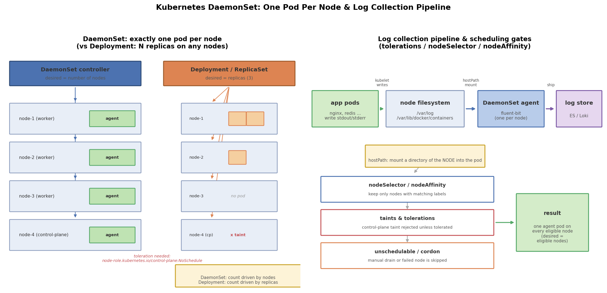

# Kubernetes DaemonSet 详解：每个节点一个 Pod 的守护进程

## 引言

Deployment 解决的是"无状态服务跑几个副本"的问题，但有一类负载的需求完全不同：**它们不在意总数，而在意覆盖面——集群里每个节点都必须恰好跑一个**。

典型场景：

- **日志采集**：Fluent Bit / Filebeat 每个节点一个 Agent，通过 hostPath 读取本节点 `/var/log` 和 `/var/lib/docker/containers` 下的容器日志
- **监控**：Node Exporter / cAdvisor 每个节点一个，采集本节点 CPU、内存、磁盘指标
- **网络插件**：CNI（Calico、Cilium）、kube-proxy 本质上也是每节点一份的守护进程，Pod 网络才能通

这类"节点级守护进程"如果用 Deployment 管理，副本数和节点数会对不上：节点扩容后新节点没有 Agent、调度器还可能把两个 Agent 堆到同一个节点上。DaemonSet 就是为此设计的工作负载——**副本数不写死，由节点数决定**。

## 文件结构

```
07_daemonset/
├── README.md    # 本文档
├── daemonset.sh        # 全流程演示脚本：apply/验证每节点一个/分布/rollout/标签调度/清理
├── manifests/
│   └── daemonset.yaml      # 两个 DaemonSet 示例：日志采集(全节点) + nodeAffinity(仅 SSD 节点)
├── scripts/
│   └── gen_arch.py        # 架构图生成脚本 (python3 scripts/gen_arch.py)
└── images/
       └── daemonset_arch.png  # 调度模型对比 + 日志采集流水线示意图
```

## 核心概念

### DaemonSet 的调度机制：每节点一个

DaemonSet 控制器（kube-controller-manager 内的 daemon pod controller）的行为逻辑：

1. 监听集群所有节点和 DaemonSet 的变化
2. 对每个 DaemonSet，计算"应该有 Pod 的节点集合"——所有**匹配 selector/affinity、且可调度**的节点
3. 节点上有 Pod 则保持，没有则创建；节点上有两个（比如手工建的）则删除多余的
4. 节点被删除或 Pod 被驱逐时，在其他匹配节点上自动补齐

所以 `kubectl get daemonset` 看到的 `DESIRED` 不是你声明的数字，而是**当前匹配的节点数**。集群从 3 节点扩到 5 节点，DaemonSet 的 desired 自动变 5，无需任何操作——这是和 Deployment 最本质的区别。

### tolerations：为什么需要容忍度才能上控制面节点

生产集群的控制面节点默认打有污点（taint）：

```
node-role.kubernetes.io/control-plane:NoSchedule
```

含义是"不许新 Pod 调度到我这"。这是为了保护 etcd / API server 等关键组件不被普通业务挤占资源。

但日志采集、监控这类 Agent 需要**全覆盖**，包括控制面节点（控制面的日志同样要采集）。办法是给 Pod 模板加 tolerations：

```yaml
tolerations:
  - key: node-role.kubernetes.io/control-plane   # 精确容忍控制面污点
    effect: NoSchedule
  - operator: Exists                             # 容忍一切污点 (最强, 慎用)
    effect: NoExecute
```

注意区分两种写法：指定 key 只容忍特定污点；`operator: Exists` 不限定 key，容忍一切匹配 effect 的污点，通常只有 kube-proxy / CNI 这种"不上就无法工作"的组件才需要。

### nodeSelector / nodeAffinity：选择性覆盖

不是所有 DaemonSet 都要全覆盖。比如只在 SSD 节点跑本地缓存 Agent：

- **nodeSelector**：最简单，节点标签完全匹配即调度
- **nodeAffinity**（`requiredDuringSchedulingIgnoredDuringExecution`）：功能更强的硬性要求，支持 `In/NotIn/Exists/Gt/Lt`、多条件、权重（preferred 软偏好）

```yaml
affinity:
  nodeAffinity:
    requiredDuringSchedulingIgnoredDuringExecution:
      nodeSelectorTerms:
        - matchExpressions:
            - key: disktype
              operator: In
              values: [ssd]
```

关键特性：**标签变化会即时生效**。给节点打上 `disktype=ssd`，DaemonSet 控制器立刻在该节点创建 Pod；去掉标签，Pod 被自动删除。`daemonset.sh` 的 `label` 步骤演示了这一过程。

### hostPath 卷：把节点目录挂进 Pod

日志采集的前提是"能看到节点上的日志文件"。kubelet 把容器 stdout/stderr 写到节点目录（`/var/log/pods`、`/var/lib/docker/containers/*-json.log`），DaemonSet Pod 用 hostPath 把这些目录只读挂进来：

```yaml
volumes:
  - name: varlog
    hostPath:
      path: /var/log
  - name: dockerlog
    hostPath:
      path: /var/lib/docker/containers
      type: Directory     # 目录不存在则报错, 避免静默挂错
```

注意 hostPath 是"逃生舱"性质的卷类型，只有节点级 Agent 这种确实需要访问节点本身的场景才应该使用；普通业务 Pod 用 hostPath 既不安全也不可移植。

## DaemonSet vs Deployment 对比

| 维度 | DaemonSet | Deployment |
|------|-----------|------------|
| 副本数 | 由匹配节点数决定，不可手动 scale | 手动声明 `replicas`，可 scale |
| 分布 | 每个节点**恰好一个** Pod | 任意节点，可能堆积也可能空缺 |
| 控制器 | DaemonSet controller（直接管理 Pod） | Deployment → ReplicaSet → Pod 三层 |
| 滚动更新 | 支持（`RollingUpdate`/`OnDelete`，默认逐节点替换，maxUnavailable 可为百分比即按节点比例） | 支持（maxSurge/maxUnavailable） |
| 典型场景 | 日志采集、监控 Agent、CNI、kube-proxy | Web 服务、API、无状态业务 |
| 节点扩容 | 新节点自动获得 Pod | 副本数不变，需手动扩容 |
| hostPath | 常用（读取节点文件） | 几乎不用（破坏可移植性） |

## 可视化

左图对比两种调度模型：DaemonSet 由节点数驱动、每节点一个（控制面节点需 toleration），Deployment 由 replicas 驱动、可以堆积也可以空缺；右图是日志采集流水线（app pods → 节点日志目录 → hostPath → DaemonSet Agent → 外部日志存储），以及 tolerations/nodeSelector/cordon 三道调度闸门如何筛选"合格节点"：



## 面试要点

1. **DaemonSet 如何保证每个节点一个 Pod**：daemon pod controller 监听节点与 DaemonSet 变化，为每个"匹配且可调度"的节点确保恰好一个 Pod——缺失则创建、多余则删除；节点加入/移除或标签变化时自动增删。它不经过默认调度器的"总数"逻辑（新版本由调度器带 `NodeAffinity` 默认注入配合完成），desired 永远等于合格节点数。
2. **为什么需要 toleration 才能上 master**：控制面节点默认打 `node-role.kubernetes.io/control-plane:NoSchedule` 污点以保护关键组件；Pod 必须显式容忍该污点才可能被调度上去。日志/监控 Agent 要全覆盖，所以要加 tolerations；`operator: Exists` 容忍一切污点，一般只有 CNI/kube-proxy 需要。
3. **典型使用场景**：日志采集（Fluent Bit/Filebeat）、节点监控（Node Exporter）、网络插件（Calico/Cilium）、kube-proxy、安全 Agent（入侵检测）、GPU 设备插件（Device Plugin）。共同点：都是"节点级守护进程"，与节点一一对应。
4. **如何滚动更新 DaemonSet**：改 Pod 模板（如镜像）即触发；默认策略 `RollingUpdate`，先逐节点杀旧建新，`maxUnavailable`（默认 1）控制同时不可用的节点数，`maxUnavailable` 可写百分比（按节点数取整）；`OnDelete` 则完全手动。`kubectl rollout status/undo/history` 用法与 Deployment 相同。注意 DaemonSet 没有 maxSurge（每节点只能有一个，无法"先建新再杀旧"）。
5. **加分手辨析**：节点被 `cordon`/`drain` 或处于不可调度状态时，DaemonSet 不会往上补 Pod；`drain` 会自动驱逐 DaemonSet Pod 并由控制器决定是否重建。

## 总结

DaemonSet = "以节点为刻度的 Deployment"。记住一条主线：**desired 由节点数决定，覆盖面由 tolerations/nodeSelector/nodeAffinity 决定，数据面靠 hostPath 触达节点本身**。配合 `daemonset.sh` 里"节点数 vs Pod 数对比"和"打标签即时增删 Pod"的演示，能直观体会"节点驱动调度"与 Deployment"replicas 驱动调度"的本质差异。
