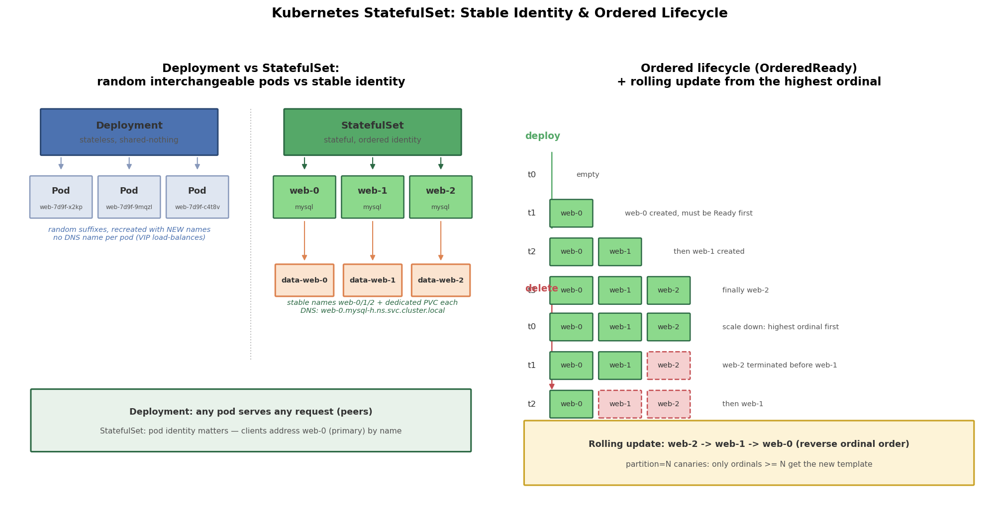

# Kubernetes StatefulSet 详解：稳定标识、独立存储与有序编排

## 引言

Deployment 假设所有 Pod 是**可互换的**：任何一个挂了，随便起一个补上即可。这对无状态服务（nginx、API 网关）完全成立，但对数据库、消息队列、分布式存储这类**有状态应用**是灾难性的，因为有状态应用需要三样 Deployment 给不了的东西：

- **稳定标识**：MySQL 主库必须一直"是"主库。Deployment 重建的 Pod 名字带随机后缀（`web-7d9f6b-x2k9p`），重建后身份就变了，谁来当主、从库连谁，全都乱了
- **独立存储**：数据库的每个实例要自己的数据目录，且重建后必须**重新挂回原来那块盘**。Deployment 的多个副本要么共享一个 PVC（互相踩数据），要么手工建 N 个
- **有序性**：主从复制要求主库先就绪、从库再启动；缩容时必须先删从库、最后删主库。Deployment 的副本是并行、无序创建删除的

StatefulSet 就是为这三个需求设计的控制器：**稳定的网络标识 + 每副本独立持久卷 + 有序的部署/扩缩容**。本例用一套模拟的 MySQL 主从集群（`web-0` 主、`web-1/2` 从）演示这三个保证。

## 文件结构

```
08_statefulset/
├── README.md    # 本文档
├── statefulset.sh       # 全流程演示：有序创建/DNS/PVC/删 Pod 验证稳定身份/扩缩容/清理
├── manifests/
│   └── statefulset.yaml     # Headless Service + StatefulSet（volumeClaimTemplates/initContainer）
├── scripts/
│   └── gen_arch.py        # 架构图生成脚本 (python3 scripts/gen_arch.py)
└── images/
       └── statefulset_arch.png # Deployment 对比图 + 有序生命周期时序图
```

## 核心概念

### 稳定网络标识：Headless Service + Pod DNS

StatefulSet 必须配一个 `clusterIP: None` 的 Headless Service。普通 Service 分配一个虚拟 IP，由 kube-proxy 做负载均衡，请求随机落到某个 Pod——你**无法指定连哪一个**。Headless Service 则不分配 VIP，DNS 为**每个 Pod 注册一条独立的 A 记录**：

```
web-0.mysql-h.default.svc.cluster.local   -> web-0 的 Pod IP
web-1.mysql-h.default.svc.cluster.local   -> web-1 的 Pod IP
```

域名的构成是 `<Pod名>.<Service名>.<命名空间>.svc.cluster.local`。Pod 重建后哪怕 IP 变了，域名不变——这就是"稳定网络标识"。有了它，从库才能通过域名稳定地连上主库，客户端才能"按名"连主库写、连从库读。`statefulset.sh` 的 `dns` 步骤用 busybox 里的 `nslookup` 直接验证了这一点。

### volumeClaimTemplates：每副本专属 PVC

Deployment 的 Pod 模板里只能引用 PVC，所有副本共享。StatefulSet 在模板外声明 **PVC 模板**，控制器为每个 Pod 生成专属 PVC：

```
PVC 名 = <模板名>-<Pod名>   =>   data-web-0 / data-web-1 / data-web-2
```

关键行为：

- Pod 删除重建后，StatefulSet 让它**重新绑定同名 PVC**，从而拿回原来的数据——"稳定持久化标识"
- 缩容只是删 Pod，**PVC 保留**；再扩容回来，新的 `web-2` 会复用 `data-web-2` 里的旧数据
- **删除 StatefulSet 本身也不会删除 PVC**，必须手工 `kubectl delete pvc`——宁可麻烦也不丢数据

### 有序部署与删除

默认 `podManagementPolicy: OrderedReady` 下：

- **创建/扩容**：按序号正序（0→1→2），`web-0` Ready 之前不创建 `web-1`——保证从库启动时主库已经就绪
- **缩容/删除**：按序号逆序（2→1→0），先删从库、最后删主库
- **滚动更新**：也是从**最大序号**开始（先更新 web-2，最后 web-0），与 Deployment 的无序替换相反；`partition` 参数可以实现金丝雀（只更新序号 ≥ partition 的 Pod）

另一个策略 `Parallel` 则像 Deployment 一样并行创建/删除，适合副本间无依赖的场景，但**不影响滚动更新仍然逆序**。

### initContainer：从上一成员克隆数据

模拟真实 MySQL 主从的冷启动流程：序号 N > 0 的 Pod 用 initContainer 从上一个成员 `web-(N-1).mysql-h...` 同步数据，全部完成后再启动 MySQL 容器。initContainer 天然串行（成功一个才跑下一个），和 OrderedReady 配合正好实现"链式依赖"。

## Deployment vs StatefulSet 对比

| 维度 | Deployment | StatefulSet |
|------|-----------|-------------|
| Pod 名 | 随机后缀，重建即变 | `web-0/1/2` 固定，重建不变 |
| Pod DNS | 无独立域名（Service VIP 转发） | `web-N.svc.ns.svc.cluster.local` |
| 需配 Service | 普通 Service（可选） | **必须 Headless Service**（`serviceName`） |
| 存储 | 共享 PVC 或手工 N 个 | volumeClaimTemplates 自动生成每副本 PVC |
| 创建顺序 | 并行、无序 | 默认正序 0→1→2（前一个 Ready 才下一个） |
| 删除顺序 | 无序 | 逆序 2→1→0 |
| 滚动更新 | 无序替换，maxSurge/maxUnavailable | 逆序（先最大序号），支持 partition 金丝雀 |
| 删除后 PVC | — | **保留**，需手工清理 |
| 适用场景 | 无状态（web/API） | 数据库、MQ、分布式存储等有状态应用 |

## 可视化

左图对比 Deployment（随机名、无独立 DNS、共享无身份）与 StatefulSet（`web-0/1/2` 固定名 + 专属 PVC + 稳定域名）；右图是 OrderedReady 下的正序创建（0→1→2）、逆序删除（2→1→0）以及逆序滚动更新时间线：



## 面试要点

1. **StatefulSet 三大保证**：(a) 稳定网络标识——Pod 名与 `<pod>.<svc>.<ns>.svc.cluster.local` 域名跨重建不变；(b) 稳定持久化标识——每副本专属 PVC，重建后重新绑回原 PV，数据不丢；(c) 有序部署/删除——OrderedReady 下正序创建（前一个 Ready 才创建下一个）、逆序删除。
2. **为什么需要 Headless Service**：普通 Service 的 VIP 把请求随机分发，无法指定连某个具体实例；有状态应用的客户端必须按名寻址（连主库 web-0、让从库连指定主库）。Headless Service 不分配 VIP，DNS 直接解析出每个 Pod 的 A 记录，才使"按 Pod 名寻址"成为可能。`serviceName` 字段还把 StatefulSet 和该 Service 关联起来。
3. **PVC 生命周期**：volumeClaimTemplates 生成的 PVC（`data-web-N`）在 Pod 删除、缩容、甚至删除整个 StatefulSet 时**都会保留**，目的是防止误删数据；代价是资源不会自动回收，需要手工 `kubectl delete pvc`。缩容再扩容回来，新 Pod 会复用旧 PVC 中的数据。
4. **扩缩容顺序**：扩容按序号正序串行（新序号最大的最后创建，且依赖前一个 Ready）；缩容按序号逆序（先删最大序号）。这个顺序保证主从语义下永远先动从库、后动主库。`Parallel` 策略可以打破创建/删除的串行，但滚动更新始终逆序。
5. **StatefulSet 如何做金丝雀发布**：`updateStrategy.rollingUpdate.partition=N`，只有序号 ≥ N 的 Pod 更新到新模板；先设 `partition=2` 只发 web-2 观察，再降到 0 全量。这比 Deployment 的 maxSurge 灰粒度更粗但身份可控。

## 总结

StatefulSet = 副本管理 + 身份管理。抓住"序号即身份"这条主线：Pod 名 `web-N` 固定，带来域名固定（Headless Service）、存储固定（volumeClaimTemplates → `data-web-N`）、顺序固定（正序建、逆序删）。配合 `statefulset.sh` 里删 Pod 后同名同 PVC 复活的演示，能直观看到它与 Deployment 的本质区别——Deployment 管的是"数量"，StatefulSet 管的是"谁是谁"。
