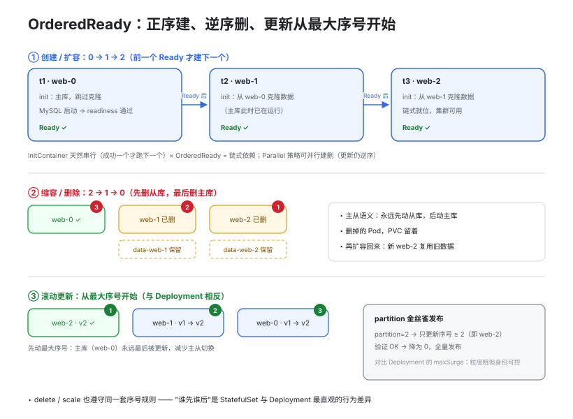

# 08 · StatefulSet：稳定标识、独立存储与有序编排

> Deployment 假设所有 Pod **可互换**——挂了随便起一个补上。这对无状态服务成立，对数据库、消息队列是灾难。StatefulSet 管的不是"数量"，而是"**谁是谁**"。

## 1. 为什么有状态应用用不了 Deployment

有状态应用需要三样 Deployment 给不了的东西：

- **稳定标识**：MySQL 主库必须一直"是"主库。Deployment 重建的 Pod 名带随机后缀（`web-7d9f6b-x2k9p`），重建后身份就变了——谁来当主、从库连谁，全乱了
- **独立存储**：每个实例要自己的数据目录，且重建后必须**重新挂回原来那块盘**。Deployment 的副本要么共享一个 PVC（互相踩数据），要么手工建 N 个
- **有序性**：主库先就绪、从库再启动；缩容先删从库、最后删主库。Deployment 的副本是并行、无序的

StatefulSet 的三大保证正对着这三点：**稳定的网络标识 + 每副本独立持久卷 + 有序的部署/扩缩容**。本例用一套模拟的 MySQL 主从（web-0 主、web-1/2 从）演示。

## 2. 快速开始

```bash
./statefulset.sh apply    # 创建并 watch 有序创建：web-0 Ready 前不会有 web-1
./statefulset.sh dns      # nslookup 验证每个 Pod 的稳定域名
./statefulset.sh pvc      # 查看 volumeClaimTemplates 生成的 data-web-0/1/2
./statefulset.sh stable   # 删掉 web-1：同名复活、重挂同一个 PVC
./statefulset.sh scale    # 扩到 5（正序）再缩回 3（逆序），观察 PVC 保留
./statefulset.sh clean    # 删 StatefulSet 后需手工删 PVC
```

## 3. 总览：序号即身份


> 🌐 **交互版**：[在线打开（GitHub Pages）](https://yong-huang.github.io/hands-on-kubernetes/labs/08_statefulset/images/sts_identity.html)（或本地打开 [`images/sts_identity.html`](images/sts_identity.html)）。

抓住"**序号即身份**"这条主线：Pod 名 `web-N` 固定，带来三样东西固定——

- **域名固定**：Headless Service 为每个 Pod 注册独立 A 记录（见 §4）
- **存储固定**：volumeClaimTemplates 为每个 Pod 生成专属 PVC `data-web-N`（见 §5）
- **顺序固定**：正序建、逆序删、更新从最大序号开始（见 §6）

右侧 Deployment 对照组正是镜像面：随机名、无独立 DNS、副本可互换——无状态服务正需要这种"可互换"，有状态应用恰恰受不了。

## 4. 稳定网络标识：Headless Service + Pod DNS

StatefulSet 必须配一个 `clusterIP: None` 的 Headless Service（通过 `serviceName` 关联）。普通 Service 的 VIP 由 kube-proxy 随机转发，你**无法指定连哪一个**；Headless 不分配 VIP，DNS 为每个 Pod 注册独立 A 记录：

```
web-0.mysql-h.default.svc.cluster.local   -> web-0 的 Pod IP
web-1.mysql-h.default.svc.cluster.local   -> web-1 的 Pod IP
```

域名构成是 `<Pod名>.<Service名>.<命名空间>.svc.cluster.local`。Pod 重建后哪怕 IP 变了，域名不变——从库靠它稳定连主库，客户端才能"按名"连主库写、连从库读。`statefulset.sh` 的 `dns` 步骤用 `nslookup` 直接验证。

## 5. 独立存储：volumeClaimTemplates

Deployment 的 Pod 模板只能引用现成的 PVC（所有副本共享）。StatefulSet 在模板外声明 **PVC 模板**，控制器为每个 Pod 生成专属 PVC：

```
PVC 名 = <模板名>-<Pod名>   =>   data-web-0 / data-web-1 / data-web-2
```

关键行为（见 §2 图底部）：

- Pod 删除重建后，**重新绑定同名 PVC**，拿回原来的数据——"稳定持久化标识"
- 缩容只删 Pod，**PVC 保留**；再扩容回来，新的 web-2 复用 data-web-2 里的旧数据
- **删除 StatefulSet 本身也不删 PVC**，必须手工 `kubectl delete pvc`——宁可麻烦也不丢数据
- 演示细节：initContainer 与主容器都通过 `subPath` 挂同一 PVC 的不同子目录（`mysql/` 放数据、`prev/` 模拟上一成员数据），否则 MySQL 检测到目录非空会拒绝初始化

## 6. 有序性：正序建、逆序删、逆序更新


> 🌐 **交互版**：[在线打开（GitHub Pages）](https://yong-huang.github.io/hands-on-kubernetes/labs/08_statefulset/images/sts_ordering.html)（或本地打开 [`images/sts_ordering.html`](images/sts_ordering.html)）。

默认 `podManagementPolicy: OrderedReady` 下：

- **创建/扩容**：按序号正序（0→1→2），web-0 Ready 之前不创建 web-1——保证从库启动时主库已就绪。initContainer 天然串行（成功一个才跑下一个），与 OrderedReady 正好组成"链式依赖"：web-N 启动前从 `web-(N-1)` 克隆数据（模拟 MySQL 从库冷初始化）
- **缩容/删除**：按序号逆序（2→1→0），先删从库、最后删主库；被删副本的 PVC 保留
- **滚动更新**：同样从最大序号开始（先 web-2 最后 web-0），与 Deployment 相反；`updateStrategy.rollingUpdate.partition` 可做金丝雀——`partition=2` 只发 web-2，验证后降为 0 全量

`Parallel` 策略可以像 Deployment 一样并行创建/删除，适合副本无依赖的场景，但**不影响滚动更新仍然逆序**。

## 7. Deployment vs StatefulSet

| 维度 | Deployment | StatefulSet |
|------|-----------|-------------|
| Pod 名 | 随机后缀，重建即变 | `web-0/1/2` 固定，重建不变 |
| Pod DNS | 无独立域名（VIP 随机转发） | `web-N.svc.ns.svc.cluster.local` |
| 需配 Service | 普通 Service（可选） | **必须 Headless Service**（`serviceName`） |
| 存储 | 共享 PVC 或手工 N 个 | volumeClaimTemplates 自动生成每副本 PVC |
| 创建顺序 | 并行、无序 | 正序 0→1→2（前一个 Ready 才下一个） |
| 删除顺序 | 无序 | 逆序 2→1→0 |
| 滚动更新 | 无序替换，maxSurge/maxUnavailable | 逆序（先最大序号），partition 金丝雀 |
| 删除后 PVC | — | **保留**，需手工清理 |
| 适用场景 | 无状态（web/API） | 数据库、MQ、分布式存储 |

## 8. 文件结构

```
08_statefulset/
├── README.md              # 本文档
├── statefulset.sh         # apply / dns / pvc / stable / scale / clean
├── manifests/
│   └── statefulset.yaml   # Headless Service + StatefulSet（volumeClaimTemplates / initContainer）
└── images/
    ├── sts_identity.workflow.json          # 图源（Typed JSON IR）
    ├── sts_identity.html        # 交互版（浏览器打开）
    └── sts_identity.svg          # 双主题矢量版   
    ├── sts_ordering.workflow.json          # 图源（Typed JSON IR）
    ├── sts_ordering.html        # 交互版（浏览器打开）
    └── sts_ordering.svg          # 双主题矢量版   
```

## 9. 深入要点

1. **三大保证**：(a) 稳定网络标识——Pod 名与 `<pod>.<svc>.<ns>.svc.cluster.local` 域名跨重建不变；(b) 稳定持久化标识——每副本专属 PVC，重建后重新绑回原 PV；(c) 有序部署/删除——正序创建（前一个 Ready 才建下一个）、逆序删除。
2. **为什么必须 Headless Service**：普通 Service 的 VIP 随机分发，无法指定实例；有状态应用必须按名寻址（连主库 web-0、从库连指定主库）。Headless 让 DNS 直接解析出每个 Pod 的 A 记录，"按 Pod 名寻址"才成为可能。
3. **PVC 生命周期**：VCT 生成的 PVC 在 Pod 删除、缩容、删除整个 StatefulSet 时**都保留**（防误删数据）；代价是要手工清理。缩容再扩容，新 Pod 复用旧 PVC 数据。
4. **扩缩容顺序**：扩容正序串行（新序号最后创建且依赖前一个 Ready）；缩容逆序（先删最大序号）——主从语义下永远先动从库。`Parallel` 打破建删串行，但更新仍逆序。
5. **金丝雀发布**：`updateStrategy.rollingUpdate.partition=N` 只更新序号 ≥ N 的 Pod；先 `partition=2` 只发 web-2 观察，再降 0 全量。比 Deployment 的 maxSurge 粒度粗，但身份可控。

## 10. 总结

StatefulSet = 副本管理 + 身份管理。主线只有一条：**序号即身份**——Pod 名 `web-N` 固定，带来域名固定（Headless Service）、存储固定（volumeClaimTemplates → `data-web-N`）、顺序固定（正序建、逆序删）。配合 `statefulset.sh` 里"删 Pod 后同名同 PVC 复活"的演示，直观看到它与 Deployment 的本质区别——Deployment 管的是"数量"，StatefulSet 管的是"谁是谁"。
