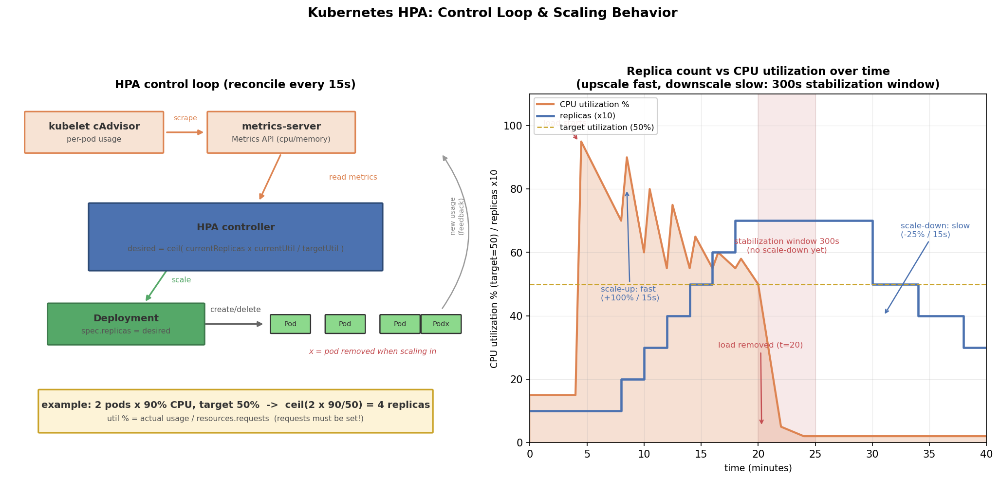

# Kubernetes HPA 详解：自动扩缩容的原理与实战

## 引言

线上流量从来不是恒定的：白天高峰、深夜低谷、大促秒杀、突发热点。如果按峰值流量静态配置副本数，低谷时资源白白浪费（成本翻倍）；按均值配置，峰值一来就过载、超时、雪崩。手动 `kubectl scale` 又有三个问题：**人反应慢**（发现过载到敲完命令可能已过几分钟）、**无法 7x24 值守**（凌晨的流量毛刺没人管）、**不知道扩到几个合适**（拍脑袋定数字）。

HPA（Horizontal Pod Autoscaler）就是把"扩缩容"交给控制器：持续观测 Pod 的 CPU/内存等指标，与目标值比对后自动增减副本数，让"实际利用率"向"目标利用率"持续收敛。配合 `behavior` 稳定窗口，还能抑制来回抖动（flapping）。

## 文件结构

```
09_hpa/
├── README.md    # 本文档
├── hpa.sh         # 全流程演示脚本：metrics-server/压测扩容/观察缩容/清理
├── manifests/
│   ├── hpa.yaml       # 多文档清单：CPU 密集型应用 Deployment + HPA (autoscaling/v2)
│   └── metrics-server.yaml  # metrics-server 安装清单 (HPA 指标来源, 本地缓存)
├── scripts/
│   └── gen_arch.py        # 架构图生成脚本 (python3 scripts/gen_arch.py)
└── images/
       └── hpa_arch.png   # 控制环 + 扩缩容时间线示意图
```

## 核心概念

### HPA 扩缩容算法

HPA 控制器默认每 15 秒 reconcile 一次，核心公式：

```
desiredReplicas = ceil( currentReplicas × (currentMetricValue / desiredMetricValue) )
```

例如目标 CPU 利用率 50%，当前 2 个副本平均利用率 90%：

```
desired = ceil(2 × 90 / 50) = ceil(3.6) = 4   →  扩到 4 个副本
```

要点：

- **利用率是所有就绪 Pod 的平均值**，不是单 Pod 最大值
- 多条 metrics（CPU、内存、自定义）时，各自算出一个 desired，**取最大值**（保守策略，宁可多扩）
- 扩容有 `tolerance`（默认 10%）：计算结果在 ±10% 以内不动，防止指标微小波动引起抖动
- 缩容时分子用的是"缩容后还剩多少 Pod"重新校验，保证缩完不会立刻又超载

### metrics-server 与资源指标

HPA 不会自己去 kubelet 抓数，指标链路是：

```
kubelet (cAdvisor)  →  metrics-server (聚合为 Metrics API)  →  HPA controller 读取
```

`Resource` 类型的 CPU/内存指标由 **metrics-server** 提供（大多数集群默认不装），装完 `kubectl top pods/nodes` 才能用。若要用 QPS、队列长度等业务指标，需要 **Prometheus Adapter** 或 KEDA 把自定义指标注册成 `custom.metrics.k8s.io`。

### 为什么必须设置 resources.requests

CPU 利用率的定义是 `实际用量 / resources.requests.cpu`——**requests 是百分比计算的分母**。没有 requests：

- HPA 无法计算 Utilization 类目标，TARGETS 列一直显示 `<unknown>`，永远不触发扩缩
- 调度器也无法把这个 Pod 安排到合适的节点

所以 `hpa.yaml` 里显式写了 `requests.cpu: 100m`：利用率 50% 意味着实际用量 50m，公式才有意义。

### behavior 稳定窗口（v2 新增）

`autoscaling/v2` 的 `behavior` 字段解决两类问题：

| 配置 | 默认行为 | 本例设置 | 目的 |
|------|----------|----------|------|
| scaleUp.stabilizationWindowSeconds | 0s | 0s | 扩容要快，立即执行 |
| scaleUp.policies | 15s 内 +100% 或 +4 Pod | 同左 | 限制单次扩容幅度，防止指标异常炸到 maxReplicas |
| scaleDown.stabilizationWindowSeconds | 300s | 300s | **缩容前需连续 5 分钟低负载** |
| scaleDown.policies | 15s 内 -25% 或 -1 Pod | 同左 | 缩容步子要小 |

缩容慢是刻意设计：刚缩掉的 Pod 就没了，流量回升时重新调度、拉镜像、预热要几十秒；而"多留几个 Pod 几分钟"的成本很低。这就是经典的**扩容快、缩容慢**的折中。

## YAML 关键字段

```yaml
spec:
  scaleTargetRef:               # 扩缩容目标（Deployment 或 StatefulSet）
    kind: Deployment
    name: cpu-stress-app
  minReplicas: 1                # 副本下限
  maxReplicas: 10               # 副本上限（硬顶，防止指标异常导致失控扩容）
  metrics:
    - type: Resource            # Pod 资源指标（metrics-server 提供）
      resource:
        name: cpu
        target:
          type: Utilization     # 利用率 %；也支持 AverageValue（绝对值）
          averageUtilization: 50
  behavior:
    scaleDown:
      stabilizationWindowSeconds: 300   # 缩容稳定窗口 5 分钟
```

几个易踩的坑：

- Pod 未设 `resources.requests` → TARGETS 显示 `<unknown>`，HPA 不工作
- kind/minikube 里 metrics-server 需加 `--kubelet-insecure-tls`（kubelet 证书无 CA 签名）
- 同时配置 CPU 和内存指标时，**内存通常设高些（如 60%）**：内存不像 CPU 那样随请求结束回落，易误触发
- 手动 `kubectl scale` 会被 HPA 在下个周期覆盖（HPA 才是期望副本数的属主）

## 可视化

左图是 HPA 控制环：kubelet cAdvisor → metrics-server → HPA 控制器按公式算出期望副本数 → 改 Deployment 的 replicas → 增删 Pod → 新 Pod 的用量又反馈回指标层，闭环收敛。右图是一次完整负载周期：负载来了 CPU 冲高、副本数快速翻倍把利用率压回 50% 附近；负载撤掉后 CPU 归零，但副本数先保持 5 分钟（稳定窗口），再按 -25%/15s 的节奏慢慢缩回：



## 面试要点

1. **HPA 扩容算法怎么算**：`desired = ceil(currentReplicas × currentValue / targetValue)`，利用率按就绪 Pod 平均、以 requests 为分母；多指标取各算出的最大 desired；±10% tolerance 内不动作；默认 15 秒一个控制周期。
2. **为什么缩容慢**：缩容有默认 300 秒稳定窗口 + 步长限制（-25%/15s）。原因是缩容错误代价高——流量回升时重新拉起 Pod 需要调度、拉镜像、预热（分钟级），而多留几个 Pod 的成本很低；扩容错误只是暂时多占资源，所以扩快缩慢是非对称设计。
3. **HPA 与 VPA / Cluster Autoscaler 的区别**：三者正交互补。HPA 调**副本数**（水平伸缩）；VPA 调**单个 Pod 的 requests/limits**（垂直伸缩，重启 Pod 生效，与 HPA 同用会冲突，除非用 In-Place 或按模式的 Autopilot）；Cluster Autoscaler 调**节点数**（节点资源不足/过剩时增删 Node）。常见组合：HPA + Cluster Autoscaler（Pod 水平扩 → 节点不够 → 加节点）。
4. **自定义指标怎么做**：`Resource` 只有 CPU/内存。业务指标（QPS、队列长度）用 **Prometheus Adapter** 把 Prometheus 查询注册为 `custom.metrics.k8s.io`（Pods 类型，按 Pod 平均）或 `external.metrics.k8s.io`（External 类型）；HPA metrics 里 `type: Pods/Object/External` 引用。更上层的 KEDA 可以直接以任意 Prometheus 查询/Lag 为信号源驱动扩缩。

## 总结

HPA = 指标 + 公式 + 控制环。记住一条主线：**metrics-server 供数 → 控制器按 `ceil(当前副本 × 当前利用率/目标利用率)` 算期望副本 → 改 Deployment 的 replicas**。两个必踩点：Pod 不设 requests 则百分比无意义；`behavior` 的稳定窗口解释了"为什么缩容那么慢"。配合 `hpa.sh` 里压测扩容、撤压测观察缩容的完整演示，能直观看到"声明式目标值 + 控制循环收敛"在自动伸缩上的又一次应用。
