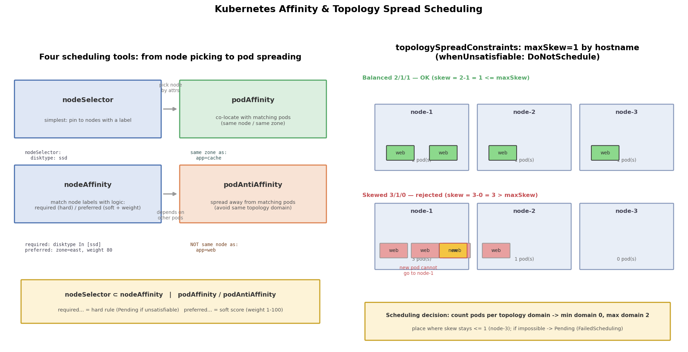

# Kubernetes 亲和性与拓扑打散：让副本真正分散到节点上

## 引言

默认调度器只看"哪个节点放得下"（资源够、污点能容忍），它**不关心副本之间在拓扑上的分布**。于是一个很常见的问题：3 副本的 Deployment 全被调度到同一个节点上——只要那个节点资源最多，打分最高，Pod 就会一个个挤过去。这个节点一宕机，三个副本同时消失，"多副本 = 高可用"的假设瞬间破产。

解决思路是给调度器加"约束"：有的约束管**去哪个节点**（nodeAffinity），有的约束管**和谁在一起/不在一起**（podAffinity / podAntiAffinity），还有的约束直接规定**各拓扑域的副本数差不能超过多少**（topologySpreadConstraints）。本篇用一组可运行的 YAML + 脚本把这些调度工具全部过一遍。

## 文件结构

```
10_affinity/
├── README.md    # 本文档
├── affinity.sh         # 全流程演示: 打标签 -> 打散验证 -> 拓扑约束拒绝 -> 清理
├── manifests/
│   └── affinity.yaml       # 四个示例: 硬性/软性 podAntiAffinity、nodeAffinity、topologySpread
├── scripts/
│   └── gen_arch.py        # 架构图生成脚本 (python3 scripts/gen_arch.py)
└── images/
       └── affinity_arch.png   # 调度工具地图 + maxSkew 打散示意图
```

## 核心概念

### nodeSelector vs nodeAffinity

两者都是"按节点标签选节点"，但能力差距很大：

- **nodeSelector**：最简单的形式，一堆 `key: value`，全部匹配才行。没有"或"、没有"非"、没有软性偏好
- **nodeAffinity**：支持 `In / NotIn / Exists / DoesNotExist / Gt / Lt` 运算符，支持多组条件，还分**硬性（required）**和**软性（preferred + weight）**两级

nodeSelector 可以看作 nodeAffinity 的一个极小子集，新项目直接写 nodeAffinity 即可。

### required vs preferred：硬性与软性

所有亲和性规则都带这一对后缀，语义完全不同：

| 后缀 | 语义 | 不满足时的行为 |
|------|------|----------------|
| `requiredDuringSchedulingIgnoredDuringExecution` | 硬性约束（过滤器） | Pod 一直 **Pending**，绝不降低要求 |
| `preferredDuringSchedulingIgnoredDuringExecution` | 软性偏好（打分器） | 正常调度，只是调度器打分时尽量避开 |

注意后缀里的 **IgnoredDuringExecution**：亲和性只在**调度那一刻**生效。Pod 已经跑起来之后，即使拓扑发生变化（比如标签被改），已运行的 Pod 也**不会被驱逐**——这和污点的 `NoExecute` 不同。

### podAntiAffinity 打散

podAntiAffinity 的含义是"不要和匹配的 Pod 落在同一个拓扑域"：

```yaml
podAntiAffinity:
  requiredDuringSchedulingIgnoredDuringExecution:
    - labelSelector:
        matchExpressions:
          - key: app
            operator: In
            values: ["web-required"]
      topologyKey: kubernetes.io/hostname
```

这段规则翻译成人话：**不允许和任何 `app=web-required` 的 Pod 在同一个节点上**。replicas=3 时，效果就是强制三副本分散到三个节点。

### topologyKey 的含义

`topologyKey` 定义了**"拓扑域"是哪个维度**，取值是节点上的标签名：

- `kubernetes.io/hostname` —— 每个节点是一个域（按节点打散）
- `topology.kubernetes.io/zone` —— 每个可用区是一个域（跨可用区打散）

同样的反亲和规则，换个 topologyKey 就从"每节点最多 1 个"变成"每可用区最多 1 个"。**节点必须都有这个标签**，缺标签的节点会被认为不满足约束。

### topologySpreadConstraints 与 maxSkew

反亲和是"每域最多 1 个"，但副本数超过节点数时就无解了。topologySpreadConstraints 更精细：**只要求各域之间的数量差（skew）不超过 maxSkew**：

```yaml
topologySpreadConstraints:
  - maxSkew: 1                          # 任意两个拓扑域的副本数差 <= 1
    topologyKey: kubernetes.io/hostname # 按节点维度
    whenUnsatisfiable: DoNotSchedule    # 硬性（换 ScheduleAnyway 则是软性）
    labelSelector:
      matchLabels:
        app: web-spread                 # 只统计本应用自己的 Pod
```

3 个节点跑 4 副本时，2/1/1 合法、3/1/0 非法（skew=3）。`whenUnsatisfiable: DoNotSchedule` 是硬性（违反就拒绝调度），`ScheduleAnyway` 是软性（违反也调度，但打分更低）。

**一个容易误解的点**：如果所有拓扑域都可进入，调度器总能均衡放置（任意副本数都能保持 skew=1，如 7 副本 -> 3/2/2），单纯加副本**不会**触发 DoNotSchedule 拒绝。拒绝只发生在"某个域进不去"时——本实验故意不容忍 control-plane 污点：控制面节点被计为 0 副本的域但 Pod 无法进入，两个 worker 各放 1 个（1/1/0）后，第 3 个副本放哪都是 skew=2，于是 Pending。

## 各方式对比

| 方式 | 作用维度 | 硬/软 | 典型场景 |
|------|----------|-------|----------|
| nodeSelector | 节点属性 | 只有硬性 | 简单地钉到 GPU/SSD 节点 |
| nodeAffinity | 节点属性 | 硬 + 软（weight） | 复杂节点选择：必须 SSD、优先东区机房 |
| podAffinity | Pod 之间 | 硬 + 软 | 前端和缓存同节点/同区，降低延迟 |
| podAntiAffinity | Pod 之间 | 硬 + 软 | 同应用副本跨节点/跨可用区打散 |
| topologySpreadConstraints | 拓扑域数量差 | DoNotSchedule / ScheduleAnyway | 副本数 > 节点数时的均匀打散 |

## 可视化

左图是四种调度工具的地图：nodeSelector / nodeAffinity 管"选哪个节点"，podAffinity / podAntiAffinity 管"和谁一起"；右图是 maxSkew=1 的拓扑打散：2/1/1 合法、3/1/0 违反约束导致新 Pod 无处可放：



## 面试要点

1. **如何保证副本跨节点分布（三种方式）**：① 硬性 podAntiAffinity（`topologyKey: kubernetes.io/hostname`，每节点最多 1 个，但副本数超过节点数时会 Pending）；② topologySpreadConstraints（maxSkew=1 + DoNotSchedule，均匀打散且支持副本数大于节点数）；③ 软性版本（preferred / ScheduleAnyway）尽量打散但不阻塞调度。生产上跨可用区高可用一般用 `topologyKey: topology.kubernetes.io/zone`。
2. **affinity 和 toleration 的区别**：亲和性是调度器对 Pod 的**主动选择偏好**（想去哪、想和谁一起）；污点/容忍度是节点对 Pod 的**准入限制**（节点先打上污点拒绝所有人，Pod 带 toleration 才能进）。一个从 Pod 视角拉，一个从节点视角推，二者同时生效时都要满足。
3. **打散后节点不够怎么办**：硬性约束下多余的副本会一直 **Pending**，`kubectl describe pod` 能看到 `FailedScheduling` 事件（如 "node(s) didn't match pod anti-affinity rules"）。这不是 bug 而是设计：可用性优先于运行率。解法是加节点、降副本数，或改用软性约束。
4. **topologySpreadConstraints vs podAntiAffinity 怎么选**：需要"每域最多 1 个"且副本数不超过域数量时，两者都能用，podAntiAffinity 更老、兼容性好；需要"均匀但允许多个"（如 5 副本进 3 节点要 2/2/1）时只能用 topologySpreadConstraints，它语义更直接（只管数量差）、还支持 `minDomains` 等细粒度控制。新项目推荐后者。

## 总结

调度约束只有两件事：**过滤（硬性）与打分（软性）**。nodeAffinity 管节点维度，pod(anti)Affinity 管 Pod 维度，topologySpreadConstraints 管数量均匀度；`required`/`DoNotSchedule` 不满足就 Pending，`preferred`/`ScheduleAnyway` 尽力而为。记住 `IgnoredDuringExecution`——这些规则只在调度瞬间生效，之后拓扑怎么变都不会动已运行的 Pod。配合 `affinity.sh` 里扩容到 7 副本触发 `FailedScheduling` 的演示（3 节点下 2/2/2 已是 maxSkew=1 的极限，第 7 个副本无处可放），能直观看到"约束太硬，节点不够"时调度器的行为。
