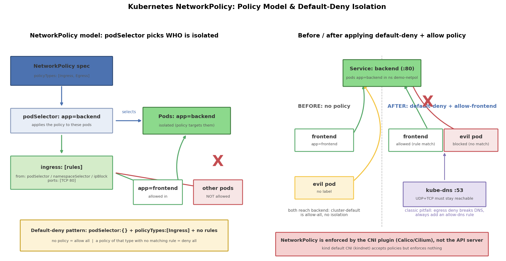

# Kubernetes NetworkPolicy 详解：默认拒绝与白名单隔离

## 引言

Service 提供的是"找到并负载均衡"，但默认情况下 Kubernetes 集群里**任何 Pod 都能访问任何 Pod**——数据库能被任意命名空间里跑偏的脚本连上，一个被攻破的 Pod 可以横向扫遍整个集群。微服务架构下的零信任（Zero Trust）理念要求"默认不信任，按需放行"，这正是 NetworkPolicy 的职责：它在 IP/端口层声明"谁能访问谁"，让 backend 只接受 frontend 的流量，让"恶意" Pod 连不上任何东西。

要注意的一点前提：**NetworkPolicy 只是声明，执行者是 CNI 插件**。API server 只做格式校验，真正在节点上编程 iptables/eBPF 的是 Calico、Cilium 这类 CNI（见后文 kind/kindnet 的坑）。

## 文件结构

```
12_network_policy/
├── README.md    # 本文档
├── network_policy.sh         # 全流程演示: CNI 检查/deploy/test/isolate/verify/clean
├── manifests/
│   └── network_policy.yaml       # 多文档 YAML: Namespace + 工作负载 + 网络策略(分组打标签)
├── scripts/
│   └── gen_arch.py        # 架构图生成脚本 (python3 scripts/gen_arch.py)
└── images/
       └── network_policy_arch.png   # 策略模型 + 隔离前后对比图
```

YAML 里用 `tier=workload` / `tier=policy` 两组标签把工作负载和策略分开，脚本就能分阶段 apply，演示"隔离前 vs 隔离后"的对比：

```bash
kubectl apply -f manifests/network_policy.yaml -l tier=workload   # 先只部署应用
kubectl apply -f manifests/network_policy.yaml -l tier=policy     # 再上隔离策略
```

## 核心概念

### NetworkPolicy 的作用机制：选中 + 加规则

一条 NetworkPolicy 由两部分语义构成：

- **podSelector（作用于谁）**：策略"选中"的 Pod 集合。`{}` 表示选中命名空间内**所有** Pod。注意它选的是**受策略影响的 Pod**（被访问方/发起方），不是"谁可以访问我"
- **ingress / egress 规则（放行谁）**：对选中的 Pod，Ingress 描述"允许什么来源进来"，Egress 描述"允许去哪些目标"

关键判定规则：**对某个 Pod 而言，某方向（Ingress 或 Egress）只要没有任何策略选中它，该方向就是全放行；一旦有至少一条策略选中它，该方向就变成"只放行规则匹配的流量，其余全拒绝"**。策略之间是叠加（并集）关系，没有优先级。

### policyTypes：管哪个方向

```yaml
policyTypes: [Ingress]        # 只限入站, 出站不管
policyTypes: [Ingress, Egress] # 双向都限
```

不写时默认取 `["Ingress"]`（若写了 egress 规则则自动加 Egress）。**Egress 一旦启用就踩 DNS 的坑**（见下文）。

### from 的三种来源选择器

```yaml
ingress:
  - from:
      - podSelector:                  # ① 同命名空间内按标签选 Pod
          matchLabels: {app: frontend}
      - namespaceSelector:            # ② 按标签选整个命名空间(所有 Pod)
          matchLabels: {ns: demo-netpol}
      - namespaceSelector:            # ②+① 组合 = "某命名空间里的某些 Pod" (同一列表项内是 AND)
          matchLabels: {kubernetes.io/metadata.name: kube-system}
        podSelector:
          matchLabels: {k8s-app: kube-dns}
      - ipBlock:                      # ③ CIDR 网段, 常用于放行集群外/节点地址
          cidr: 10.244.0.0/16
          except: [10.244.1.0/24]     # 排除例外段
```

注意列表项之间是 **OR**（任一匹配即放行），同一列表项内的多个选择器是 **AND**。

### 默认拒绝（default-deny）模式

零信任的第一步不是"写放行规则"，而是先**全网拒绝**再按需打洞：

```yaml
spec:
  podSelector: {}        # 选中所有 Pod
  policyTypes: [Ingress] # 只声明方向, 不写 ingress 字段 => 入站全拒绝
```

之后再叠加白名单策略（如 allow-frontend-to-backend）逐个放行。Egress 方向同理。这是生产上管理"东西向流量"的标准套路。

### DNS 放行的坑（出站隔离的头号事故）

一旦启用 Egress 默认拒绝，Pod 连 kube-dns 的 53 端口也被拦，`wget http://backend` 会先卡在域名解析上——**所有服务名瞬间不可达，且报错看起来像"网络不通"而非"DNS 被拦"**。必须显式放行：

```yaml
egress:
  - to:
      - namespaceSelector:
          matchLabels: {kubernetes.io/metadata.name: kube-system}
        podSelector:
          matchLabels: {k8s-app: kube-dns}
    ports:
      - {protocol: UDP, port: 53}    # DNS 主要走 UDP
      - {protocol: TCP, port: 53}    # 大响应/TCP 回退也要放
```

本文 YAML 里这段作为可选示例注释保留，三个 Egress 策略（deny-all + allow-dns + allow-to-backend）必须一起启用，缺一个就会"莫名其妙"断网。

## YAML 关键字段

```yaml
spec:
  podSelector:                # 策略作用于哪些 Pod (受影响方)
    matchLabels:
      app: backend
  policyTypes: ["Ingress"]    # 管哪个方向; 不列的方向不受限
  ingress:
    - from:                   # 一个列表项 = 一条规则 (多条规则之间 OR)
        - podSelector:
            matchLabels:
              app: frontend   # 只放行同命名空间 app=frontend 的 Pod
      ports:
        - protocol: TCP
          port: 80            # 注意: 指的是 Pod 的端口(targetPort), 不是 Service 端口
```

几个易踩的坑：

- **podSelector 选的是"受策略影响的 Pod"**，不是"允许访问的来源"——来源在 `ingress.from` 里写，初学者最容易搞反
- `ports.port` 是 **Pod/容器端口**；即使通过 Service 访问，策略匹配的也是最终落到后端 Pod 的 targetPort
- NetworkPolicy 是**命名空间级别**的对象，`from.podSelector` 只在**同命名空间**内选；跨命名空间必须配合 `namespaceSelector`
- 策略叠加是并集：多条策略选中同一 Pod 时，任一条放行即放行，没有 deny 规则（K8s 原生没有"黑名单"，要黑名单得用 CNI 扩展如 Calico 的 `calico-plugin` 全局策略）

## kind/kindnet 不生效问题与 Calico 方案

kind 默认的 CNI 是 kindnet，**不支持 NetworkPolicy**：`kubectl apply` 能成功（API server 只做 schema 校验），`kubectl get networkpolicy` 也能看到对象，但节点上不会有任何 iptables 规则——隔离完全不存在，脚本里 evil Pod 的 wget 照样通。`network_policy.sh` 启动时会自动检测 CNI 并给出警告。

想真实体验隔离，给 kind 换 Calico（核心是**镜像要预先 load 进节点**，否则 calico-node 起不来）：

```bash
# 1) 拉取并导出镜像 (国内建议配置 docker.io/calico/* 的镜像加速)
docker pull calico/node:v3.28.0
docker pull calico/cni:v3.28.0
docker pull calico/pod2daemon-flexvol:v3.28.0
docker save calico/node calico/cni calico/pod2daemon-flexvol -o calico.tar
# 2) 加载进 kind 节点
kind load image-archive calico.tar --name <kind集群名>
# 3) 安装并等待就绪 (可顺手删除 kindnet DaemonSet)
kubectl apply -f https://raw.githubusercontent.com/projectcalico/calico/v3.28.0/manifests/calico.yaml
kubectl -n kube-system rollout status ds/calico-node
```

## 可视化

左图是策略模型：podSelector 决定"谁被隔离"，ingress 规则（from + ports）决定"谁能进来"，以及"无策略=全放行、有策略无规则=全拒绝"的默认拒绝语义；右图是隔离前后对比：frontend 被白名单放行、evil 被拦截、DNS 必须例外放行，并注明策略由 CNI 插件执行：



## 面试要点

1. **NetworkPolicy 由谁执行？** CNI 插件（Calico/Cilium 等），不是 API server、不是 kube-proxy。API server 只负责存储和校验对象；节点上的 CNI 把策略编程成 iptables/IPSet 或 eBPF 规则。所以 kindnet 这类不支持策略的 CNI 下，对象能创建但毫无效果——"写了策略≠有隔离"，换 CNI 前需验证。
2. **Pod 一旦被 Ingress 策略选中，其他流量全拒绝吗？** 是的。该方向一旦存在选中它的策略，就从"默认全放行"切换为"只放行规则匹配的流量"；多条策略之间是并集叠加，且 K8s 原生没有 deny 规则（黑名单需 CNI 扩展实现）。没有被任何策略选中的 Pod 该方向保持全放行。
3. **命名空间之间默认隔离吗？** 网络层默认**不隔离**——跨命名空间的 Pod 可以直接互访（除非 CNI 有额外配置）。要隔离需用 namespaceSelector：跨命名空间放行时 `from` 里必须写 namespaceSelector（可再叠 podSelector 表示"该命名空间里的某些 Pod"）；NetworkPolicy 对象本身也只作用于自己所在的命名空间。
4. **NetworkPolicy 与 RBAC 的区别？** 完全不同层的东西：RBAC 管 **Kubernetes API 的访问控制**（谁能 kubectl get/watch/edit 什么资源），主体是用户/ServiceAccount；NetworkPolicy 管 **Pod 之间的网络流量**（L3/L4，谁能连谁的哪个端口），主体是 Pod/IP。RBAC 挡不住 Pod 之间的 TCP 连接，NetworkPolicy 也挡不住某人调 API。

## 总结

NetworkPolicy = podSelector（选中受影响的 Pod）+ 分方向的规则（Ingress 的 from/ports、Egress 的 to/ports）。记住三条判定主线：无策略全放行、有策略只放行匹配流量、策略叠加取并集。生产实践先打 default-deny 再按需开洞，开 Egress 时别忘了放行 kube-dns 的 53 端口。最后切记执行者是 CNI 插件——在 kindnet 上"验证通过"的隔离可能是假的。配合 `network_policy.sh` 的 before/after 对比演示，能直观看到白名单放行 frontend、拦截 evil 的效果。
