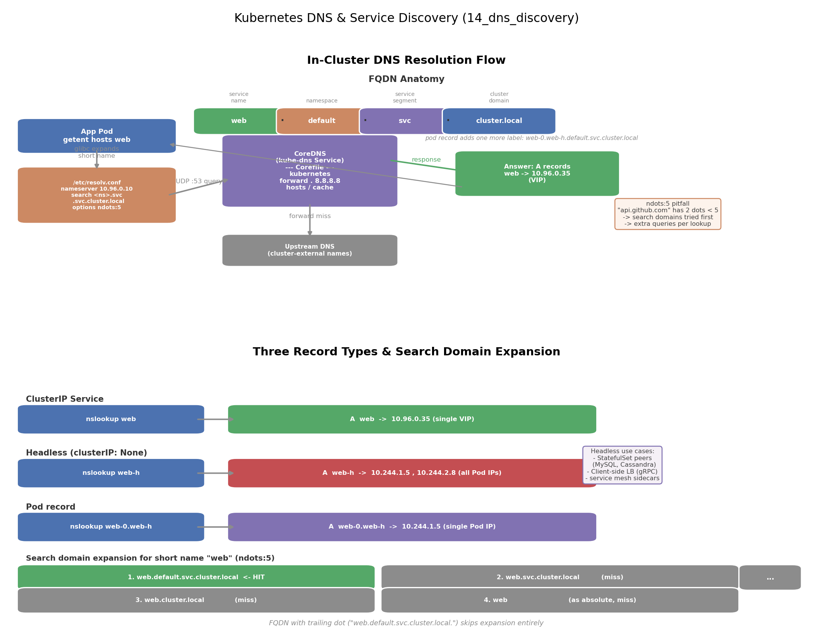

# Kubernetes DNS 与服务发现详解：ClusterIP、Headless 与 Pod 级域名

## 引言

集群里有 3 个 nginx Pod，客户端该连哪个 IP？答案是"一个都别连"。Pod IP 是易变的（重建、漂移、扩缩容都会变），把 IP 写死等于把脆弱性写进代码。Kubernetes 的解法是**用 DNS 做服务发现**：每个 Service 创建时，CoreDNS 自动为它生成一条域名记录，客户端只需要记名字。

为什么选 DNS 而不是注册中心（如 ZooKeeper/Eureka）？因为 DNS 是所有语言、所有框架都内置的解析机制——`getaddrinfo("web")` 就完成了一次服务发现，客户端零依赖、零改造。Kubernetes 只是把"名字 → 地址"的映射做成了声明式 API 的副产品。

本项目在 kind 集群里实测三种 DNS 记录（ClusterIP / Headless / Pod 级），并演示自定义 dnsConfig 注入。

## 文件结构

```
14_dns_discovery/
├── README.md    # 本文档
├── dns.sh               # 全流程演示脚本：deploy/test/clean
├── manifests/
│   └── dns_discovery.yaml   # 多文档 YAML：Headless + StatefulSet + ClusterIP Service + 自定义 DNS Pod
├── scripts/
│   └── gen_arch.py        # 架构图生成脚本 (python3 scripts/gen_arch.py)
└── images/
       └── dns_discovery_arch.png # 解析流程与三种记录对比图
```

## 核心概念

### CoreDNS 与 Corefile

CoreDNS 是集群的 DNS 服务器，以 Deployment 跑在 kube-system 里，通过名为 `kube-dns` 的 Service 暴露（通常 10.96.0.10）。它的行为由 Corefile（ConfigMap）驱动，采用**插件链**架构：

```
.:53 {
    errors
    kubernetes cluster.local in-addr.arpa {   # 核心：监听 Service/Endpoint 变化生成记录
        pods insecure
    }
    forward . 8.8.8.8                         # 集群内查不到 → 转发外部 DNS
    hosts { ... }                             # 自定义 hosts 记录
    cache 30                                  # 缓存
}
```

请求进来后依次经过插件：`kubernetes` 插件管 `cluster.local` 后缀，`forward` 插件兜底外部域名。

### search domains 与 ndots

每个 Pod 的 `/etc/resolv.conf` 大致如下：

```
nameserver 10.96.0.10
search default.svc.cluster.local svc.cluster.local cluster.local
options ndots:5
```

解析短名 `web` 时，glibc 按 ndots 规则决定是否拼接搜索域：**名字中的点数 < ndots(5) 就先用搜索域逐个补全再查**，最后才把原始名当绝对域名。所以 `web` 会按 `web.default.svc.cluster.local`（命中）→ `web.svc.cluster.local` → `web.cluster.local` → `web` 的顺序尝试。

### 三种 DNS 记录

| 记录类型 | 触发条件 | nslookup 返回 |
|----------|----------|---------------|
| Service（ClusterIP） | 任何普通 Service | 单个虚拟 IP（VIP） |
| Headless Service | `clusterIP: None` | 所有就绪 Pod 的真实 IP 列表 |
| Pod 级 | hostname + subdomain，或 StatefulSet + serviceName | 单个 Pod 的 IP |

### dnsPolicy 与 dnsConfig

- `dnsPolicy: ClusterFirst`（默认）：resolv.conf 指向 CoreDNS，外部域名由 CoreDNS forward 出去
- `dnsPolicy: None`：完全忽略集群 DNS，必须配合 `dnsConfig` 自定义 nameservers
- `dnsConfig`：无论哪种 policy 都可追加 nameservers / searches / options（如把 ndots 调低）

## YAML 关键字段

```yaml
# Headless Service：DNS 直接返回 Pod IP，无 VIP、无 kube-proxy 规则
spec:
  clusterIP: None

# StatefulSet：Pod 名有序稳定，serviceName 指向 Headless 后自动生成 Pod 记录
spec:
  serviceName: web-h        # web-0.web-h.default.svc.cluster.local
  replicas: 2

# 普通 Pod 想要自己的 DNS 记录，两个条件缺一不可
spec:
  hostname: myhost          # 条件 1：主机名
  subdomain: web-h          # 条件 2：必须指向一个已存在的 Headless Service
  dnsPolicy: ClusterFirst
  dnsConfig:                # 追加注入 resolv.conf
    nameservers: [8.8.8.8]
    searches: [default.svc.cluster.local]
    options:
      - { name: ndots, value: "2" }
```

几个易踩的坑：

- **subdomain 必须真实存在**：它要对应一个 Headless Service，否则 Pod 记录不生成
- StatefulSet 的 Pod 记录只在 Pod Running 时存在，且（默认 `publishNotReadyAddresses: false`）只包含 Ready 的 Pod
- `dnsPolicy: None` 而不写 dnsConfig 是非法配置，Pod 起不来

## 实测结果

`./dns.sh test` 的关键输出（IP 以实际集群为准）：

```
# a) 普通 Service：一个 VIP
nslookup web        ->  Address: 10.96.0.35

# b) Headless：全部 Pod IP
nslookup web-h      ->  Address: 10.244.1.5
                        Address: 10.244.2.8

# c) Pod 级：单个 Pod IP
nslookup web-0.web-h ->  Address: 10.244.1.5
nslookup web-1.web-h ->  Address: 10.244.2.8

# e) DNS 服务本身也是被 DNS 发现的
nslookup kube-dns.kube-system.svc.cluster.local -> 10.96.0.10
```

## 可视化

左图是集群内 DNS 解析全流程（应用 → resolv.conf 搜索域展开 → CoreDNS 插件链 → A 记录应答）与 FQDN 逐段解剖；右图对比三种记录的解析结果，并展示短名 `web` 的搜索域展开顺序：



## 面试要点

1. **ndots:5 的坑**：外部域名如 `api.github.com` 只有 2 个点 < 5，解析器会先把它拼上 3 个搜索域各查一遍（全部 NXDOMAIN），最后才查绝对域名——一次本可直接命中的解析变成了 4 次查询。高频外部调用的优化手段：用 `dnsConfig` 调低 ndots、写全 FQDN、或结尾加点（`api.github.com.`）表示绝对域名。
2. **Headless 的使用场景**① 有状态集群的节点间互相发现（MySQL 主从、Cassandra、Kafka broker 用 `<pod>.<headless-svc>` 找到固定对端）；② 客户端自己做负载均衡（gRPC 长连接会粘住 VIP 后的单个 Pod，Headless 让客户端拿到全量 IP 列表自选）；③ Service Mesh 中 sidecar 直连。
3. **Pod DNS 的生成条件**：普通 Pod 必须同时声明 `hostname` + `subdomain`（subdomain 须对应已存在的 Headless Service）；StatefulSet 通过 `serviceName` 自动完成这两件事，所以它的 Pod 天生有稳定网络标识——这也是 StatefulSet 区别于 Deployment 的三要素之一（稳定 hostname、有序启停、独立存储）。
4. **自定义 DNS 注入**：`dnsPolicy` 控制整体策略（ClusterFirst / None 等），`dnsConfig` 做增量注入（nameservers/searches/options）。典型用法：给特定 Pod 配私有 DNS、调 ndots、追加搜索域；`dnsPolicy: None` + `dnsConfig` 可完全接管解析。
5. **CoreDNS 与 kube-dns 的关系**：CoreDNS 是 CNCF 毕业项目，自 1.13 起取代 kube-dns 成为默认；但 Service 名仍叫 `kube-dns`（兼容存量配置），面试时要能说清这层历史。

## 总结

Kubernetes 服务发现的本质是"声明式 API 的 DNS 副产品"：创建 Service 即自动获得 `<svc>.<ns>.svc.cluster.local`。记住三条主线——**FQDN 结构**（service.namespace.svc.cluster.local）、**三种记录的差异**（VIP vs Pod IP 列表 vs 单 Pod IP）、**解析路径**（resolv.conf 搜索域 + ndots → CoreDNS 插件链 → forward 兜底）。配合 `dns.sh` 里的五组 nslookup 实测，能把"为什么 Headless 返回多个 IP"、"ndots:5 为什么慢"这类问题落到看得见的输出上。
