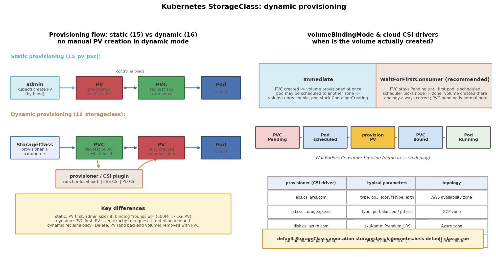

# Kubernetes StorageClass：动态供给、延迟绑定与 CSI

## 引言

上一篇（15_pv_pvc）的静态供给有个明显的运维痛点：**PV 要管理员手动创建**。用户提一个 500Mi 的 PVC，管理员得先估算容量、选节点路径、写 YAML、apply 一个 PV；容量给大了浪费（绑定"就大不就小"且整块独占），给小了绑不上；用户一多，管理员就成了人肉供给器。而且静态 PV 的拓扑（hostPath 在哪个节点）要手动配 nodeAffinity，配错就挂载失败。

动态供给把"建卷"这一步交给控制器：管理员只定义一次 **StorageClass**（用哪个供给器、什么参数），之后用户只写 PVC——控制器按需**自动创建精确大小的 PV 并绑定**，PVC 删除时按 reclaimPolicy 自动回收。一次配置，终身供给。

## 文件结构

```
16_storageclass/
├── README.md    # 本文档
├── sc.sh                 # 全流程演示脚本: deploy/test/reclaim/clean
├── manifests/
│   └── storageclass.yaml     # StorageClass(fast-local) + PVC + 挂载 Pod
├── scripts/
│   └── gen_arch.py        # 架构图生成脚本 (python3 scripts/gen_arch.py)
└── images/
       └── storageclass_arch.png # 供给流程与绑定模式示意图
```

## 核心概念

### StorageClass 的四个关键字段

```yaml
provisioner: rancher.io/local-path   # 谁来真正建卷/删卷
parameters:  {type: gp3}             # 传给 provisioner 的参数（因驱动而异）
reclaimPolicy: Delete                # 删 PVC 时 PV 与数据一并删除（动态默认）
volumeBindingMode: WaitForFirstConsumer  # 什么时候触发供给与绑定
```

- **provisioner**：供给器的名字。可以是 CSI 驱动（`ebs.csi.aws.com`）、遗留的 in-tree 插件（`kubernetes.io/aws-ebs`，已淘汰）、或外部 provisioner（kind 自带的 `rancher.io/local-path`）
- **parameters**：纯透传，K8s 不解释；比如 EBS 的 `type: gp3`、`iops: "3000"`，GCE PD 的 `type: pd-balanced`
- **reclaimPolicy**：动态供给默认 `Delete`——PV 对象和底层真实卷一起删，不需要 15 里那套"手动删 PV + docker exec 清数据"的回收流程
- **volumeBindingMode**：见下文，这是本项目的演示重点

### volumeBindingMode：Immediate vs WaitForFirstConsumer

| 模式 | 何时建卷 | 问题/优势 |
|------|---------|----------|
| Immediate | PVC 一创建就供给绑定 | 云上卷可能建在可用区 A，Pod 却调度到可用区 B——跨区挂不了盘，Pod 卡在 ContainerCreating |
| WaitForFirstConsumer | 第一个用该 PVC 的 **Pod 完成调度后**才供给 | 卷跟随 Pod 落在同一节点/可用区，拓扑永远正确；代价是 PVC 会"正常地"Pending 一段时间 |

拓扑约束（topology）是这个模式存在的根本原因：云盘是分可用区的，local 盘是分节点的，卷必须在"Pod 能调度到的地方"建出来。所以现代 CSI 驱动几乎都要求 WaitForFirstConsumer。

### 默认 StorageClass

带 `storageclass.kubernetes.io/is-default-class: "true"` annotation 的 SC 是集群默认：PVC 的 `storageClassName` 留空（或省略）时自动用它供给。kind 集群自带的 `standard`（local-path，Immediate）就是默认 SC。集群内不应同时有两个默认 SC，否则 PVC 会因歧义而报错。

### CSI 驱动架构

CSI（Container Storage Interface）是把存储操作从 K8s 核心代码里剥离出来的标准接口：

```
K8s 控制面 (API Server, PV controller, scheduler)
   │  watch PVC / Pod 事件
   ▼
external-provisioner 等 sidecar ──gRPC──▶ CSI plugin (kubelet 节点上的 DaemonSet)
                                              │  调用云 API / 本地命令
                                              ▼
                                         存储后端 (EBS / PD / local-path 目录)
```

创建/删除卷走控制面 sidecar，挂载/卸载走节点上的 CSI plugin（kubelet 通过 gRPC 调它）。K8s 只认接口不认厂商——新增一种存储只需装一个 CSI 驱动，不用改 Kubernetes 代码。

## YAML 关键字段

```yaml
# StorageClass（管理员定义一次）
provisioner: rancher.io/local-path        # kind 节点内置, 无需额外安装
volumeBindingMode: WaitForFirstConsumer   # Pod 调度后再建卷, 拓扑正确
reclaimPolicy: Delete                     # PVC 删 -> PV 自动删
# annotation 打上 is-default-class 即成为默认 SC

# PVC（用户每次申请）
spec:
  storageClassName: fast-local   # 指定 SC; 留空 = 默认 SC
  resources:
    requests:
      storage: 500Mi             # 动态供给按此精确建卷, 不再有"就大不就小"
```

易踩的坑：

- WaitForFirstConsumer 下 PVC Pending 是**正常状态**，不是故障；要检查的是引用它的 Pod 为什么没调度起来
- PVC 删除卡 Terminating 通常是因为还有 Pod 在用它（pvc-protection finalizer）
- `allowVolumeExpansion: true` 才能在线扩容 PVC，且取决于 CSI 驱动是否支持

## kind 的 local-path 与云 CSI 的差异

kind 集群自带的 `standard` StorageClass 由 rancher/local-path-provisioner 驱动：它**不是 CSI 驱动**，而是一个独立的 external-provisioner，建卷动作只是在 Pod 所在的 kind 节点容器里 `mkdir` 一个目录，再生成 hostPath PV。但**动态供给的完整流程（SC → PVC Pending → Pod 调度 → 自动建 PV → Bound → Delete 回收）与云上 CSI 完全一致**，所以用 kind 学动态供给是零成本的。生产云上的差别在于：provisioner 换成 CSI 驱动（真的会调云 API 开一块盘）、parameters 有意义（卷类型/IOPS）、topology 从"节点"升级为"可用区"。

## 可视化

左图对比静态（15）与动态（16）供给流程：静态是管理员先手工建 PV、控制器再绑定；动态是 PVC → StorageClass → provisioner/CSI 插件 → PV 自动创建。右图是 Immediate vs WaitForFirstConsumer 的时间线（PVC Pending → Pod 调度 → 建 PV → Bound → Running）与常见云 CSI 驱动的参数/拓扑示例表：



## 面试要点

1. **动态绑定的完整流程**：用户创建 PVC（指定 SC 或留空用默认）→ PV controller 发现该 PVC 无 PV 可绑且 SC 有 provisioner → 等待绑定条件满足（WFFC 时等 Pod 调度）→ external-provisioner/CSI sidecar 调供给器建卷 → 生成 PV 对象 → 控制器把 PV 与 PVC 绑定（claimRef）→ kubelet 挂载。全程无人工介入。
2. **WaitForFirstConsumer 为什么存在**：为了拓扑正确。云盘绑定可用区、local 盘绑定节点，只有先知道 Pod 调度到哪，才能把卷建在"够得着"的地方；Immediate 先建卷后调度，可能跨区导致永久挂载失败。
3. **默认 SC 的优先级与规则**：PVC 的 `storageClassName` 显式指定 → 用指定 SC；留空且存在默认 SC → 用默认 SC 动态供给；留空且没有任何 SC → 尝试绑定已有 PV（旧语义）。注意 PVC 里写 `storageClassName: ""` 是"明确不要动态供给"，与省略字段不同。
4. **CSI 是什么**：Container Storage Interface，一套 gRPC 标准接口（CreateVolume/DeleteVolume/ControllerPublish/NodeStage/NodePublish 等），把存储驱动从 K8s in-tree 代码解耦成独立组件（控制面 sidecar + 节点 DaemonSet）。K8s 通过 sidecar 与 CSI plugin 交互，新增存储后端无需改 K8s 源码。
5. **动态供给下 reclaimPolicy 的选择**：默认 Delete——PVC 删了卷和数据一起没，干净但危险；数据库类卷应显式设 `Retain`（或依赖快照/备份），避免误删 PVC 导致数据蒸发。

## 总结

StorageClass 把存储供给从"管理员手工运维"变成"声明式自助服务"：管理员定义一次供给模板，用户只管提 PVC，卷的创建、精确容量、拓扑放置、回收全部自动化。与 15 对照着看最直观：静态供给里我们手写 PV、手动清数据；这里 PVC Pending → Pod 调度 → PV 冒出来 → 删 PVC 连 PV 一起消失，一条命令都没多敲。记住三个关键词：provisioner（谁来建卷）、volumeBindingMode（什么时候建，为什么等 Pod）、is-default-class（留空用谁）。
