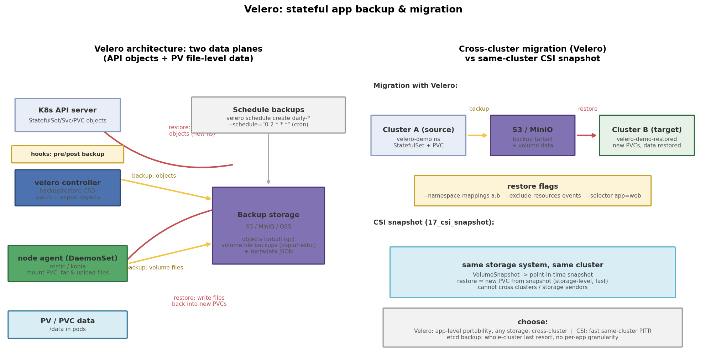

# Velero：有状态应用的备份与跨集群迁移

## 引言

前面的项目覆盖了存储的"生前"：PV/PVC 绑定、StorageClass 动态供给、CSI 快照。但真实运维还有一个"生死攸关"的问题：**这台集群没了（升级/迁移/故障），我的数据库和它几十个 PVC 怎么办？** `kubectl apply` 只能重建"无状态"的那半边——Deployment、Service 这些 YAML 可以从 Git 里再来一遍，但 PV 里的数据不在 Git 里。

Velero（原 Heptio Ark，现归 VMware Tanzu）就是干这个的：**把一个 namespace 的 API 对象和 PV 数据一起打包到对象存储，之后随时在任意集群恢复**。它是"集群级 rsync + 时间机器"，也是跨集群迁移的标准工具。

## 文件结构

```
18_velero_migration/
├── README.md    # 本文档
├── velero.sh               # check/install/deploy/backup/restore/clean 全流程脚本
├── manifests/
│   └── velero_demo.yaml        # Namespace + headless Service + StatefulSet(volumeClaimTemplates)
├── scripts/
│   └── gen_arch.py        # 架构图生成脚本 (python3 scripts/gen_arch.py)
└── images/
       └── velero_migration_arch.png # 架构与迁移流程示意图
```

## 核心概念

### Velero 备份什么：两条数据平面

一次 `velero backup create` 实际做两件事：

1. **API 对象面**：velero controller（Deployment，单副本）watch 并导出目标范围内的所有 K8s 对象（Deployment/StatefulSet/Service/ConfigMap/PVC 定义...），打成 tarball 上传。这一步只依赖 API server，与存储类型无关。
2. **PV 数据面**，两条路线：
   - **文件系统备份（node agent）**：`--use-node-agent` 会在每个节点跑一个 DaemonSet（restic 或 kopia 后端），把 PVC 挂载路径下的文件打包上传。**通用性最好**，kind/自建/任何存储都能用，也是跨集群迁移的主力。安装时加 `--default-volumes-to-filesystem-backup` 让所有 PVC 默认走这条路，或在 Pod 上打注解 `backup.velero.io/backup-volumes: "data"`。
   - **CSI 快照**：调 VolumeSnapshot 走存储驱动的块级快照。速度最快，但快照留在**原存储系统**里——跨集群迁移时目标集群根本读不到它，只适合同集群的 PITR（上个项目 17 的主题）。

### 恢复语义：namespace mapping 是迁移的灵魂

`velero restore create --from-backup demo-backup --namespace-mappings velero-demo:velero-demo-restored` 会把备份里所有 namespace 级对象改名后在新 namespace 重建；PVC 被重新动态供给，node agent 再把文件数据灌回去——`web-0` 的新 PVC 里出现了备份前写入的 `marker.log`，迁移闭环。其他常用开关：`--exclude-resources events,endpoints`（垃圾对象不要恢复）、`--selector app=web`（只恢复带标签的子集）、`--existing-resource-policy update`（目标已存在时是覆盖还是跳过）。

### 生产对象存储

Velero 必须有一个 BackupStorageLocation，**只认 S3 协议**：AWS S3、自建 MinIO、阿里 OSS（S3 兼容端点）都行。本机 kind 演习时通常没有 S3，`velero.sh` 的诚实做法是：没配 `VELERO_S3_BUCKET` 时只打印教学输出，不做假装成功的真实操作。

## YAML 关键字段

```yaml
# StatefulSet 的身份三件套
spec:
  serviceName: web                  # headless service, 提供 web-0.web... DNS
  volumeClaimTemplates:             # 每副本独立 PVC: data-web-0, data-web-1
    - metadata: { name: data }
      spec:
        accessModes: ["ReadWriteOnce"]
        resources: { requests: { storage: 128Mi } }  # kind 默认 SC 动态供给

# Pod 模板注解: 告诉 node agent 备份哪些卷
metadata:
  annotations:
    backup.velero.io/backup-volumes: "data"
```

## 国内网络注意

- **镜像**：`docker.io/velero/velero` 与 `velero/velero-plugin-for-aws` 都在 docker.io，kind 环境先 `docker pull` 再用仓库根的 `scripts/load_images.sh`（从本实验目录即 `../../scripts/load_images.sh`）灌进节点；node agent 镜像同理。
- **CLI**：`brew install velero` 或 GitHub release 下载（darwin-amd64/arm64 tar.gz），release 下载慢可走代理但务必核对 checksum；CLI 版本与服务端保持一致（本项目按 v1.14）。
- **对象存储**：国内用 OSS 的 S3 兼容端点或自建 MinIO（`--backup-location-config s3ForcePathStyle=true,s3Url=http://minio:9000`）。

## 可视化

左图是 Velero 双平面架构：controller 导出 API 对象、node agent 打包 PV 文件，汇入 S3/MinIO，restore 反向走；右图是跨集群迁移流程（backup → 对象存储 → restore + namespace mapping），并与同集群 CSI 快照、etcd 备份做对比：



## 面试要点

1. **Velero vs CSI 快照 vs etcd 备份**：Velero——应用级（按 namespace/label），API 对象 + 文件级卷数据，可跨集群，恢复粒度细；CSI 快照——存储级，同集群同存储的快速 PITR，不能跨存储厂商；etcd 备份——整集群最后手段（`etcdctl snapshot save`），恢复即回滚整个控制面，无应用粒度，且不含容器镜像/外部数据。
2. **跨集群迁移的完整步骤**：目标集群装 Velero 并指向**同一个** BackupStorageLocation → `velero backup create --include-namespaces X --wait`（确认 Completed、无 volume 错误）→ 目标集群 `velero restore create --from-backup ... --namespace-mappings` → 验证 Pod Ready 与数据 → 切流量（DNS/Ingress）。前提：两边 StorageClass 名字匹配（可在 restore 时 `--snapshot-move-data` 或改 SC）。
3. **hooks 是干什么的**：备份一致性。`pre` hook 在备份前执行（如 `pg_dump`、`FLUSH TABLES WITH READ LOCK`、fsync），`post` hook 在完成后解锁——文件级备份抓的是"正在写的文件"，数据库不 quiesce 可能拿到不一致的页。
4. **RTO/RPO**：RPO 取决于备份频率（`velero schedule create daily --schedule="0 2 * * *"` 即每日一份，RPO ≤ 24h；持续数据要靠应用层复制）；RTO ≈ 恢复对象 + 重供给 PVC + 回灌文件数据的时间，大 PVC 文件级恢复最慢——生产上"小 RTO"场景用 CSI 快照或 Volume Data Mover。
5. **node agent 怎么读到别的 Pod 的卷**：DaemonSet 在每个节点上以宿主挂载 `/var/lib/kubelet/pods`，通过 volumeMount 找到同节点 Pod 的 PVC 实际路径，直接读文件——所以它**不需要业务 Pod 配合**，但要求 Pod 的卷落在 agent 所在节点（DaemonSet 覆盖所有节点即满足）。

## 总结

Velero 的本质是把"应用 + 数据"整体搬进对象存储这个中立地带：controller 管 API 对象，node agent 管文件数据，restore 用 namespace mapping 实现跨集群/跨环境迁移。记住三条对比线：文件级（可迁移）vs 块级快照（同集群快）、应用级粒度 vs etcd 全量、备份一致性靠 hooks。配合 `velero.sh` 里"备份 marker.log → 恢复到新 namespace → 文件还在"的闭环，跨集群迁移就不再是个黑盒。
