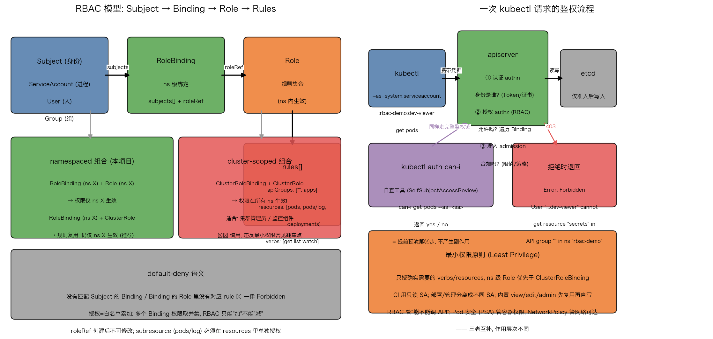

# Kubernetes RBAC 详解：角色、绑定与最小权限原则

## 引言

一个集群里不止管理员在调 API：CI 流水线要部署应用、监控组件要读 Pod 状态、Pod 内的应用要 watch ConfigMap。**谁**能对**哪些资源**做**什么操作**——这个问题由 RBAC（基于角色的访问控制）回答。它的设计哲学是最小权限原则（least privilege）：**没有被显式授权的操作，默认全部拒绝（default-deny）**。

RBAC 的优雅之处在于把"身份"和"权限"解耦：权限定义在 Role 里，通过 Binding 绑到 Subject 上。一个 Role 可以被多个身份复用，一个身份也可以累积多个 Binding 的权限。

## 文件结构

```
19_rbac/
├── README.md    # 本文档
├── rbac.sh        # 全流程演示脚本: deploy/verify/deny/clean
├── manifests/
│   └── rbac.yaml      # Namespace + 两个 SA/Role/RoleBinding 身份组合 + demo Deployment
├── scripts/
│   └── gen_arch.py        # 架构图生成脚本 (python3 scripts/gen_arch.py)
└── images/
       └── rbac_arch.png  # RBAC 模型与鉴权流程示意图
```

## 核心概念

### 认证 vs 授权

每次 API 请求都要过两道关：**认证（authn）回答"你是谁"**——通过客户端证书、Token、ServiceAccount Token 等确定身份；**授权（authz）回答"你可以吗"**——RBAC 是其中最常用的模式（还有 Node/ABAC/Webhook 等）。认证在前授权在后，先有身份才谈得上权限。

### 四件套：Role / ClusterRole / RoleBinding / ClusterRoleBinding

| 对象 | 级别 | 作用 |
|------|------|------|
| Role | namespace | 权限规则集合，只在所在 ns 生效 |
| ClusterRole | 集群 | 集群级资源（Node/PV/ns）的规则；或"可跨 ns 复用的规则模板" |
| RoleBinding | namespace | 把 Role/ClusterRole 绑到 Subject，生效于本 ns |
| ClusterRoleBinding | 集群 | 把 ClusterRole 绑到 Subject，**所有 ns 生效** |

关键组合是 **RoleBinding + ClusterRole**：规则定义一次（如内置的 `view`），在每个 ns 里用 ns 级 Binding 引用——规则复用但权限不出 ns，这是最推荐的姿势。

### verbs 与 subresources

- **verbs** 是动作：`get/list/watch/create/update/patch/delete/deletecollection`，还有 `*` 通配与 `impersonate`（允许模拟他人，高危）
- **子资源（subresource）要单独授权**：`kubectl logs` 实际请求的是 `GET /api/v1/namespaces/{ns}/pods/{name}/log`，对应 resource 是 `pods/log` 而不是 `pods`。只授了 pods 的 get 是拉不了日志的——本项目专门演示了这一点

### ServiceAccount vs User

- **ServiceAccount 是进程身份**，集群内的对象（有 Token），给 CI、控制器、Pod 内应用用
- **User/Group 是人的身份**，由外部认证体系（OIDC、证书 CN 等）提供，K8s 里没有 User 对象，`kubectl create user` 不存在
- Binding 的 `subjects.kind` 三选一：`ServiceAccount`（要带 namespace）/ `User` / `Group`

### default-deny 语义

RBAC 只有白名单没有黑名单：多个 Binding 的权限**取并集**，无法用一条规则"减掉"权限。没匹配到任何规则就是 Forbidden。所以授权粒度宁细勿粗——给了 `*` 就收不回来了。

## YAML 关键字段

```yaml
# Role: 一组规则
rules:
  - apiGroups: [""]               # "" = 核心 API 组 (pods/services/configmaps)
    resources: ["pods", "pods/log"]  # 子资源必须显式列出
    verbs: ["get", "list", "watch"]  # 只读三件套

# RoleBinding: subjects + roleRef
subjects:
  - kind: ServiceAccount
    name: dev-viewer
    namespace: rbac-demo           # SA 是 ns 级资源，namespace 必须写对
roleRef:                           # 创建后不可修改（immutable），换角色只能删了重建
  apiGroup: rbac.authorization.k8s.io
  kind: Role                       # 也可以写 ClusterRole（ns 级生效）
  name: pod-reader
```

常见漏配：`deployments` 在 `apps` 组而不是核心组；`resourceNames` 字段可以把 get 限定到具体对象名；ClusterRole 里可以写 `aggregationRule` 从其他 ClusterRole 聚合规则。

## 验证三件套

1. **`kubectl auth can-i <verb> <resource> -n <ns> --as=<user>`**：预演授权判定，返回 yes/no，无副作用，是 CI 里断言权限的利器。SA 的完整用户名是 `system:serviceaccount:<ns>:<sa>`
2. **`--as` 模拟**：给任何 kubectl 命令加上身份伪装（前提是你是 admin，有 impersonate 权限），直接跑真实操作看结果——本项目的 deny 步骤用它展示真实的 Forbidden 报错
3. **`kubectl describe rolebinding <name>`**：查看绑定链两端——subjects 是谁、roleRef 指向哪个 Role

## 可视化

左图是 RBAC 四件套模型：Subject（SA/User/Group）经 Binding 接到 Role 的 rules，以及 namespaced 组合与 cluster-scoped 组合的对比；右图是一次 kubectl 请求的完整链路：认证 → RBAC 授权 → 准入 → etcd，加上 can-i 自查与最小权限原则：



## 面试要点

1. **Role 和 ClusterRole 的区别**：作用域不同——Role 的规则只在所在 ns 生效，ClusterRole 面向集群级资源（Node/PV/Namespace）或做跨 ns 复用的规则模板。注意"规则定义在哪"和"权限生效在哪"由 Binding 决定：ClusterRole + RoleBinding 依然只在本 ns 生效，ClusterRole + ClusterRoleBinding 才是全集群生效。
2. **RBAC 的判断流程**：apiserver 收到请求后先认证出用户（含组、SA 信息），再遍历所有匹配该用户的 Binding（RoleBinding + ClusterRoleBinding），累加其引用 Role 的规则，任一规则的 apiGroups/resources/verbs（及 resourceNames）匹配请求即放行；全部不匹配返回 403 Forbidden。权限只加不减（并集）。
3. **常见坑**：① 写了 Role 忘了 Binding（最常见）；② Role 和 Binding/请求的 namespace 不匹配；③ 只授 `pods` 漏了 `pods/log` 等子资源，`kubectl logs/exec` 报 Forbidden（exec 还需要 `pods/exec`）；④ deployments 在 apps 组，写成核心组匹配不上；⑤ 集群级资源（PV/Node）用 Role 授权永远不生效；⑥ roleRef 不可变，改绑定要删重建。
4. **RBAC 与 PSA / NetworkPolicy 的层次**：RBAC 管"谁能调 K8s API"（控制面）；Pod Security Admission 管容器本身的权限（privileged/hostPath 等，数据面）；NetworkPolicy 管 Pod 间网络可达性（网络面）。三者互补，安全要分层设防——RBAC 挡不住容器逃逸，NetworkPolicy 挡不住越权的 kubectl。

## 总结

RBAC 的本质是"身份与权限解耦 + 白名单累加 + 默认拒绝"。记住三条主线：四件套的组合矩阵（Role/ClusterRole × RoleBinding/ClusterRoleBinding，Binding 决定生效范围）、规则三要素（apiGroups/resources/verbs，子资源要单列）、验证工具链（can-i 预演、--as 模拟、describe 查链路）。配合 `rbac.sh` 里"yes/no 矩阵 + 真实 Forbidden 报错"的演示，能直观体会最小权限原则在 K8s 里的落地方式。
