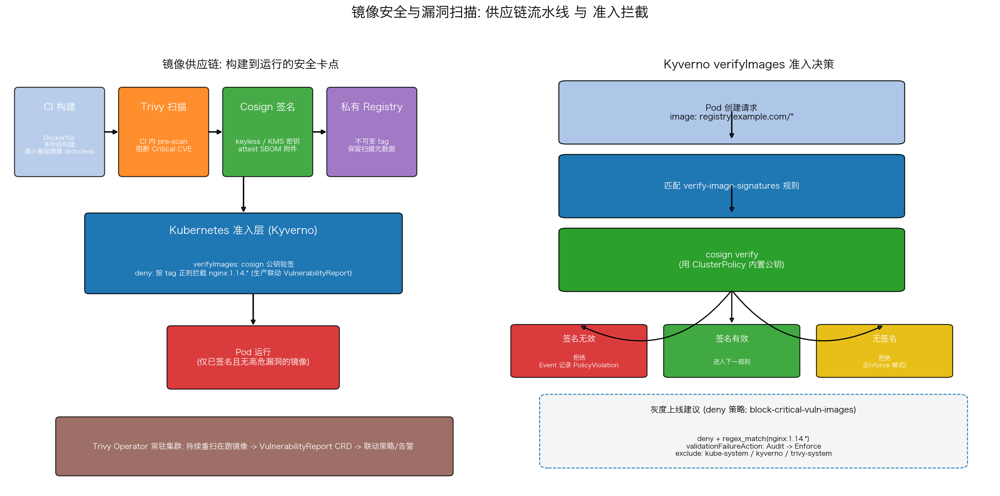

# 镜像安全与漏洞扫描

## 文件结构

```
21_image_security/
├── README.md     # 本文档
├── image_security.sh # 全流程演示脚本（步骤见脚本头部注释）
├── manifests/
│   └── image_security.yaml  # 演示用的 K8s 清单
├── scripts/
│   └── gen_arch.py   # 架构图生成脚本 (python3 scripts/gen_arch.py)
└── images/
    └── image_security_arch.png   # 架构图（gen_arch.py 生成）
```

## 项目概述

容器逃逸、供应链投毒是 K8s 生产环境最常见的攻击面。本项目（`image_security.yaml` + `image_security.sh`）搭建三层防线：**Trivy Operator 持续扫描**在跑镜像并生成 `VulnerabilityReport` CRD；**Cosign** 给镜像签名保证来源可信；**Kyverno 准入策略**在 Pod 创建时验签 + 拦截含 Critical 漏洞的镜像——目标是让"带高危漏洞的镜像无法部署"成为集群的默认行为而非事后补救。

---

## 核心机制解析

### 1. Trivy Operator：把扫描结果变成 K8s 资源

```bash
helm upgrade --install trivy-operator aqua/trivy-operator \
  --namespace trivy-system --set trivy.ignoreUnfixed=true
```

Operator 以 DaemonSet/Deployment 形式常驻，自动发现工作负载镜像并离线比对 CVE 库，产物不是日志而是 **CRD 对象**（VulnerabilityReport）。`ignoreUnfixed=true` 过滤掉没有修复版本的 CVE——报告的价值在于"可行动"，列出永远修不了的洞只会造成告警疲劳。

### 2. VulnerabilityReport：数据结构即接口

```yaml
report.summary: {criticalCount: 3, highCount: 11, ...}
report.vulnerabilities[0]: {vulnerabilityID: CVE-2019-9511, fixedVersion: "1.25.3"}
```

扫描结果标准化后，消费方不再局限于人看仪表板：Grafana 可以画趋势、Kyverno/Gatekeeper 可以引用字段做策略判定、CI 可以 `kubectl get vulnerabilityreport -o json | jq` 做门禁。**报告即资源**是整个方案的关键设计。

### 3. Kyverno verifyImages：准入时验签

```yaml
verifyImages:
  - imageReferences: ["registry.example.com/*"]
    attestors:
      - entries:
          - keys: {publicKeys: ...}
```

与扫描不同，签名校验发生在 webhook 准入路径上：Pod 创建请求被拦截 → 用 ClusterPolicy 内置公钥执行 cosign verify → 无签名或签名无效直接拒绝（Enforce 模式下）。这保证了"镜像从构建到运行没有被篡改过"，弥补了扫描只管已知漏洞、不管恶意内容的盲区。

### 4. 灰度路径：Audit → Enforce

清单里的拦截策略（`block-critical-vuln-images`）以 `validationFailureAction: Audit` 安装（`tier=policy` 分层，deploy 阶段只装应用），`image_security.sh policy` 步骤先以 Audit 模式观察，`deny` 步骤再 `kubectl patch` 切到 Enforce，现场演示 `nginx:1.14.x` 新 Pod 被准入拒绝。注意该策略按**镜像 tag**拦截（tag 即已知漏洞版本的指纹，模拟"依据报告拦截"）；生产环境应改为真正依据 trivy-operator 生成的 `VulnerabilityReport` 数据做门禁（如 policy-reporter 联动，或在 CI 查询报告后再放行部署）。

```yaml
validate:
  foreach:
    - list: "request.object.spec.containers"
      deny:
        conditions:
          any:
            - key: "{{ regex_match('^nginx:1\\.14\\..*', element.image) }}"
              operator: Equals
              value: true
exclude:
  any:
    - namespaces: ["kube-system", "kyverno", "trivy-system"]
```

注意不要用 `"!*nginx:1.14.*"` 这类取反通配——Kyverno pattern 不支持该语法；deny 规则 + JMESPath 条件（`regex_match`）才是正确写法。直接对全集群开 Enforce 会误伤系统组件（它们常拉取未签名的基础设施镜像），所以策略必须带 namespace exclude，并先 `Audit` 收集违规面、确认豁免清单后再切换强制模式。

---

## 可视化分析



上图两面板：
- **左图 供应链流水线**：构建 → Trivy 扫描 → Cosign 签名 → 私有 Registry 四个卡点，进入 K8s 准入层双重校验（验签 + 高危拦截）后才允许 Pod 运行；底部是 Trivy Operator 的持续重扫闭环
- **右图 Kyverno 决策流**：Pod 请求 → 匹配规则 → cosign verify 三种结局（有效放行 / 无效拒绝 / 无签名拒绝），附灰度上线建议

---

## 工程延伸

- **SBOM 附件**: cosign attest 把 SBOM 签进镜像，审计时可证明"部署的就是扫过的那份"
- **keyless 签名**: 用 OIDC 短期证书替代长期密钥，避免私钥管理负担
- **策略即代码**: Kyverno policies 放 Git 仓库走 PR 审批 + ArgoCD 同步，安全策略也 GitOps 化
- **准入前移**: CI 里跑 `trivy image --exit-code 1 --severity CRITICAL`，把拦截提前到推送之前，省去"进了集群再被拒"的返工
