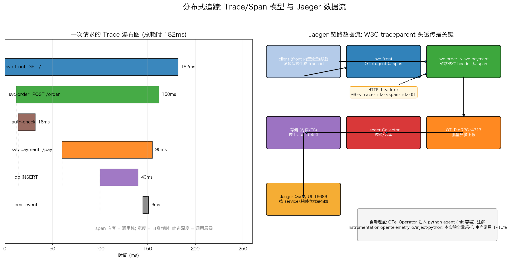

# 分布式追踪（Jaeger）

## 文件结构

```
25_jaeger_tracing/
├── README.md     # 本文档
├── jaeger_tracing.sh # 全流程演示脚本（步骤见脚本头部注释）
├── manifests/
│   └── jaeger_tracing.yaml  # 演示用的 K8s 清单
├── scripts/
│   └── gen_arch.py   # 架构图生成脚本 (python3 scripts/gen_arch.py)
└── images/
    └── jaeger_tracing_arch.png   # 架构图（gen_arch.py 生成）
```

## 项目概述

指标告诉你"慢了"，日志告诉你"错了"，但跨三个服务的请求到底慢在哪一跳？本项目（`jaeger_tracing.yaml` + `jaeger_tracing.sh`）部署 Jaeger all-in-one，通过 **OpenTelemetry Operator 的 Python 自动埋点**给三个真实微服务（front → order → payment，代码放 ConfigMap、镜像用 `python:3.12-slim`）注入 OTel agent，span 经 OTLP 上报 Jaeger——目标是让微服务调用链在 Jaeger UI 上以瀑布图完整呈现。

诚实预期：首次 `deploy` 需要拉取 python/cert-manager/operator 等镜像，init 容器还要把 OTel agent 拷进 Pod，冷启动几分钟属正常；`trace` 步骤前也要等前端流量线程跑几轮（脚本已内置 sleep）。

---

## 核心机制解析

### 1. Trace 与 Span：给调用栈拍 X 光

```text
svc-front  GET /            [============182ms==========]
  └ svc-order POST /order     [==150ms==]
      └ svc-payment /pay        [==95ms==]
          └ db INSERT             [=40ms=]
```

一次请求是一个 **Trace**（全局唯一 trace-id），每次函数/HTTP 调用是一个 **Span**（记录开始时间、耗时、标签），Span 间以 parent-span-id 构成树。瀑布图上 span 的宽度就是自身耗时——一眼看出 payment 里 db INSERT 占了 40ms，是这条慢请求的元凶。

### 2. Context 传播：链路得以延续的唯一前提

```text
traceparent: 00-<trace-id>-<span-id>-01
```

分布式环境下没有魔法：上游把当前上下文编码进 HTTP 头，**下游必须透传**这个头再发起自己的出站调用，span 才能挂到同一棵树上。本实验的 Python 服务里：入口用 `extract()` 从请求头恢复上下文挂 server span，出站 urllib 调用由 agent 自动建 client span 并透传 header。断链的典型症状是 Jaeger 里出现大量只有单 span 的孤儿 trace——十有八九是某层服务没透传 header。

### 3. 自动埋点：OpenTelemetry Operator + Instrumentation CR

```yaml
annotations:
  instrumentation.opentelemetry.io/inject-python: "demo-instrumentation"
```

只有注解不够——它依赖 OTel Operator（先 `./jaeger_tracing.sh install`，脚本会装 cert-manager 与固定版本的 operator）和一个 `Instrumentation` CR：operator 看到注解后给 Pod 加 init 容器，把 python agent 拷到 `/otel-auto-instrumentation` 并设置 `PYTHONPATH`，`sitecustomize` 随解释器启动自动初始化 TracerProvider，按 CR 的 `exporter.endpoint` 上报。应用代码零依赖安装，换语言（java/nodejs）只是换注解。

### 4. OTLP：统一的上报协议

```yaml
env: [{name: COLLECTOR_OTLP_ENABLED, value: "true"}]
ports: [{name: otlp-grpc, containerPort: 4317}]
```

Jaeger 1.5x 原生开放 OTLP gRPC 入口（4317），CR 里的 `exporter.endpoint` 就指向它。OTel SDK → OTLP Collector 已成为厂商中立的事实标准：换后端（Jaeger→Tempo）只需改 collector 的导出配置，应用零改动。SDK 批量异步上报，对业务延迟的影响通常在微秒级。

### 5. 采样：追踪的成本阀门

本实验未配置采样——agent 默认 `parentbased_always_on`（全量），教学场景要保证每条请求都能在 UI 上看到。生产上全量追踪在高 QPS 下存储成本爆炸：头部采样（head sampling）在入口通过 `OTEL_TRACES_SAMPLER=parentbased_traceidratio` + 采样率参数（常用 1%~10%）决定是否记录；再配合 OTel Collector 的尾部采样（tail sampling）processor 把错误请求与慢请求 100% 保留——排障时最需要的恰恰是那部分异常流量。

---

## 可视化分析



上图两面板：
- **左图 Trace 瀑布图**：模拟一条 182ms 请求的 span 树，缩进表示父子层级、宽度表示耗时，虚线连接父子 span；payment 的 db INSERT 一眼可见为瓶颈段
- **右图 数据流**：client 生成 trace-id → frontend/order/payment 在 OTel agent（operator 注入的 init 容器）加持下建 span 并透传 header → OTLP gRPC 批量上报 → Jaeger Collector 入库 → Query UI 检索；附采样率控制说明

---

## 工程延伸

- **尾部采样**: OTel Tail Sampling Processor 按 status/duration/路由动态决策，错误与慢请求全保
- **Trace↔Log 关联**: 日志里打 trace-id、span 注入 log correlation 字段，Jaeger 点进 span 能跳日志
- **存储选型**: all-in-one 内存存储仅限实验；生产用 Elasticsearch（复用 EFK 集群）或 Tempo（对象存储成本最低）
- **性能剖析联动**: eBPF Profiling（如 Pyroscope）按 span 时段抓火焰图，回答"这 40ms 具体耗在哪个函数"
