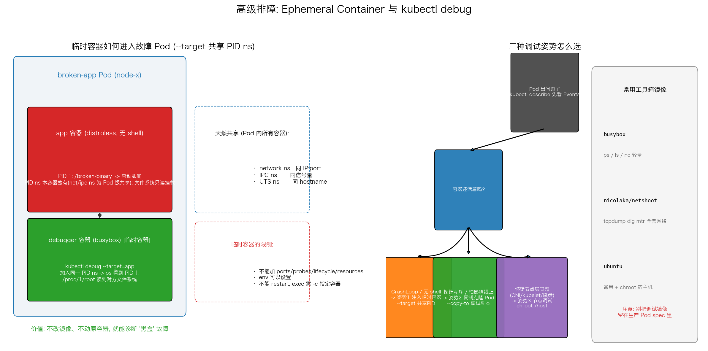

# 高级排障（Ephemeral Container 调试）

## 文件结构

```
26_ephemeral_debug/
├── README.md     # 本文档
├── debug.sh         # 全流程演示脚本（步骤见脚本头部注释）
├── manifests/
│   └── broken_pod.yaml  # 演示用的 K8s 清单
├── scripts/
│   └── gen_arch.py   # 架构图生成脚本 (python3 scripts/gen_arch.py)
└── images/
    └── ephemeral_debug_arch.png   # 架构图（gen_arch.py 生成）
```

## 项目概述

最棘手的故障现场往往是这样：容器 CrashLoopBackOff 进不去 exec，镜像又是 distroless 连 shell 都没有，`kubectl logs` 只有半行堆栈。本项目（`broken_pod.yaml` + `debug.sh`）刻意构造这种"黑盒"现场，练习 `kubectl debug` 的三种姿势——临时容器注入、克隆 Pod 调试、节点级调试——目标是掌握不重启、不改镜像、不影响线上的排障手段。

---

## 核心机制解析

### 1. Ephemeral Container：Pod 的"急诊室"

```bash
kubectl debug broken-app -it --image=busybox:1.36 --target=app -- sh
```

临时容器是加进 `spec.ephemeralContainers` 的特殊容器：与业务容器共享 network/IPC/UTS 命名空间（所以同 IP、能抓包），但**不能声明 ports/probes/lifecycle/resources**（env 是允许的）、不能重启。它不是修复手段而是诊断手段——看完病就随 Pod 一起消失。

### 2. `--target`：共享 PID 命名空间是关键

```text
app 容器:   PID 1 = /broken-binary (崩溃)
debugger:   ps aux 可见 PID 1 -> /proc/1/root/ 即对方根文件系统
```

默认各容器 PID 隔离，加了 `--target=app` 后调试容器加入目标容器的 PID ns，才能看到它的进程、读 `/proc/<pid>/root` 下的文件、甚至 gdb attach。不加 target 时你只是在一个空壳里装忙。

### 3. 三种姿势各有战场

```bash
# 姿势1: 注入临时容器(上面) —— 活着或崩溃的容器都行
# 姿势2: 克隆副本, 原 Pod 不动
kubectl debug broken-app --copy-to=broken-app-debug \
    --image=ubuntu --sleep-forever
# 姿势3: 节点层, chroot 宿主机
kubectl debug node/<node> -it --image=ubuntu
```

姿势 2 解决"探针互斥"问题：有些故障一 attach 就消失（heisenbug），复制一份带工具箱的克隆随便折腾；姿势 3 把视角抬到宿主机，`chroot /host` 后 systemctl/journalctl/ipvsadm 全套可用——怀疑 CNI 或 kubelet 时这是唯一的入口。

### 4. 工具箱镜像的选择

nicolaka/netshoot 是网络诊断瑞士军刀（tcpdump/dig/mtr/nslookup），busybox 胜在轻量，ubuntu 适合 chroot 场景。原则：**调试镜像只出现在 ephemeralContainers 里**，绝不混进生产 Pod spec。

---

## 可视化分析



上图两面板：
- **左图 Pod 剖面**：故障 app 容器与注入的 debugger 容器共享 PID ns 后互相可见（`--target` 效果）；右侧对比 Pod 内天然共享的三种命名空间和临时容器的三条限制
- **右图 决策树**：CrashLoop/无 shell → 姿势 1；探针互斥/怕影响线上 → 姿势 2；怀疑节点层 → 姿势 3；附常用工具箱镜像清单与安全提醒

---

## 工程延伸

- **strace/gdb**: 共享 PID 后可对 PID 1 执行 strace -p 系统调用追踪，定位 hang 死点
- **eBPF 升级版**: kubectl-trace / inspektor-gadget 在内核态观察，无需目标镜像配合
- **自动化预案**: 把常见 debug 流程写成脚本/Operator，故障时自动注入采集器再通知人
- **权限收敛**: ephemeralcontainers subresource 写权限要单独 RBAC 控制，避免人人可往生产 Pod 里塞容器
