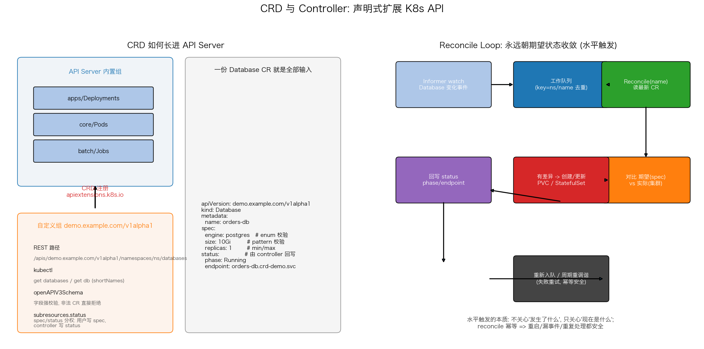

# 自定义资源（CRD）与 Controller

## 文件结构

```
29_crd_controller/
├── README.md     # 本文档
├── crd_controller.sh # 全流程演示脚本（步骤见脚本头部注释）
├── controller.py    # Database CRD Controller（Reconcile 循环）
├── manifests/
│   └── database_crd.yaml  # 演示用的 K8s 清单
├── scripts/
│   └── gen_arch.py   # 架构图生成脚本 (python3 scripts/gen_arch.py)
└── images/
    └── crd_controller_arch.png   # 架构图（gen_arch.py 生成）
```

## 项目概述

K8s 的可扩展性核心在于：API Server 不需要内置所有概念。本项目（`database_crd.yaml` + `controller.py`）自定义一个 `Database` CRD——用户声明"我要一个 postgres/10Gi"，**Controller 的 Reconcile 循环**负责创建对应的 StatefulSet 并回写 status——目标是亲手实现 Operator Pattern 的最小闭环，并理解"调谐"与"命令式部署"的本质区别。

---

## 核心机制解析

### 1. CRD：给 API Server 长出新端点

```yaml
spec:
  group: demo.example.com
  names: {plural: databases, singular: database, shortNames: ["db"]}
  versions: [{name: v1alpha1, served: true, storage: true}]
```

CRD 提交后 API Server 立刻多出一组 REST 路径（`/apis/demo.example.com/.../databases`），kubectl 无需任何修改即可 `get db`。三个关键点：`openAPIV3Schema` 让非法 CR 在准入时就被拒（enum/pattern/min-max 全部生效）；`storage` 版本全局只能有一个；`v1alpha1 → v1beta1 → v1` 的演进靠 conversion webhook。

### 2. spec/status 分权

```yaml
subresources:
  status: {}
```

启用 `/status` 子资源后形成契约：**spec 由用户写**（期望状态），**status 只归 controller 写**（实际状态）。没有这一层，controller 回写状态会触发 watch 事件风暴——它自己写的东西又把自己唤醒。

### 3. Reconcile Loop：水平触发，不是边沿触发

```python
def reconcile(name):
    cr = CO.get_namespaced_custom_object(...)   # 读期望
    try: APPS.read_namespaced_stateful_set(...)
    except ApiException as e:
        if e.status == 404: APPS.create_(...)    # 缺 -> 建
        # 存在但漂移 -> patch
```

Controller 不关心"发生了什么事件"（边缘触发），只对比"期望 vs 实际"（水平触发）。因此**幂等是灵魂**：重复执行、漏掉事件、进程重启都不会造成错误动作。演示脚本里的 drift 实验直接手动把 STS 副本改成 2，下一个循环 controller 自动拉回——这就是自愈的原理。

### 4. 轮询只是教学版

示例用 `while True + list` 每 10 秒轮询。生产级 Operator 用 **Informer + 工作队列**：watch 增量事件、按 `ns/name` 去重入队、限速重试。架构不变，只是驱动方式从"定时看一眼"变成"变化即触发 + 周期兜底"。

---

## 可视化分析



上图两面板：
- **左图 API 扩展结构**：CRD 把自定义组挂进 API Server 后形成的 REST 路径 / kubectl 别名 / schema 校验 / spec-status 分权四要素；右侧是一份完整的 Database CR 示例
- **右图 Reconcile 循环**：Informer → 队列去重 → Reconcile → 对比期望与实际 → 创建/更新 → 回写 status → 重入队的完整闭环，附水平触发的本质说明

---

## 工程延伸

- **Operator SDK**: 用 kubebuilder/controller-runtime 替代裸 client-go，自动生成 informer/rbac/webhook 骨架
- **Webhook 准入**: 给 Database 加 defaulting/validation webhook，CR 提交时自动补默认值
- **Finalizer**: 删除 CR 时先清理外部资源（真实 DB 实例），避免孤儿
- **升级路径**: v1alpha1→v1 的字段变更写 conversion webhook，老 CR 无需迁移
- **生态对照**: Prometheus Operator 的 ServiceMonitor、ArgoCD 的 Application——你现在能读懂它们都是同一模式的实例
