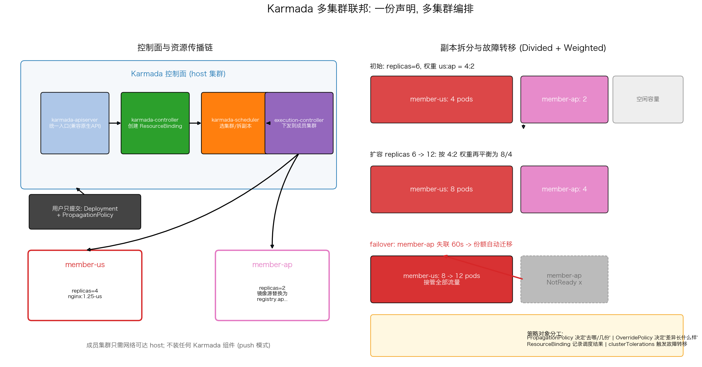

# 多集群联邦管理（Karmada）

## 文件结构

```
30_multicluster_federation/
├── README.md     # 本文档
├── karmada.sh       # 全流程演示脚本（步骤见脚本头部注释）
├── manifests/
│   └── karmada.yaml  # 演示用的 K8s 清单
├── scripts/
│   └── gen_arch.py   # 架构图生成脚本 (python3 scripts/gen_arch.py)
└── images/
    └── multicluster_federation_arch.png   # 架构图（gen_arch.py 生成）
```

## 项目概述

单集群的天花板很快会到：跨地域延迟、容灾隔离、爆炸半径控制、多供应商议价。本项目（`karmada.yaml` + `karmada.sh`）用 **Karmada** 实现联邦编排——一份 Deployment 声明配合 PropagationPolicy，6 个副本按 4:2 权重自动拆到 member-us 和 member-ap 两个集群，并演练失联故障转移——目标是掌握"一个 API 管所有集群"的多集群范式。

---

## 核心机制解析

### 1. 控制面架构：聚合 API 而非代理转发

```text
用户 -> karmada-apiserver(统一入口) -> controller 生成 ResourceBinding
     -> scheduler 决定每家分多少 -> execution-controller 下发成员集群
```

Karmada 控制面跑在 host 集群，`karmadactl join` 注册成员后，成员集群**不需要安装任何组件**（push 模式）。karmada-apiserver 与原生 API 完全兼容——kubectl 直接可用，现有 YAML 原样提交。

### 2. PropagationPolicy：分发即策略

```yaml
placement:
  clusterAffinity: {clusterNames: [member-us, member-ap]}
  replicaScheduling:
    replicaSchedulingType: Divided        # 拆分, 不是复制
    weightPreference:
      staticWeightList:
        - {targetCluster: {clusterNames: [member-us]}, weight: 4}
        - {targetCluster: {clusterNames: [member-ap]}, weight: 2}
```

`Duplicated`（每个集群全量 N 副本）适合无状态就近接入；`Divided + Weighted` 把总副本数按权重切开，适合算力成本敏感场景。改总副本数时调度器按同样权重自动再平衡——扩容不再需要逐集群操作。

### 3. OverridePolicy：一份声明，各地差异

```yaml
imageOverrider:
  - component: Registry      # 亚太替换镜像源
    operator: replace
    value: registry.ap.example.com
```

地域间的现实差异（镜像仓库、副本数、资源规格、时区配置）全部收敛进 OverridePolicy。应用模板保持单一事实源，差异以补丁形式声明——这正是多环境配置管理在多集群维度的延伸。

### 4. 故障转移：容忍度驱动迁移

```yaml
clusterTolerations:
  - key: cluster.karmada.io/not-ready
    operator: Exists
    tolerationSeconds: 60
```

成员集群心跳超时超过 60 秒后，其 ResourceBinding 份额被重新调度到健康集群。注意权衡：网络抖动误判会造成"脑裂双跑"，生产要结合应用层幂等/数据一致性设计，而不是无脑缩短阈值。

---

## 可视化分析



上图两面板：
- **左图 控制面传播链**：apiserver → controller → scheduler → execution 四级流水线把声明送达两个成员集群；标注 push 模式下成员零侵入
- **右图 调度与转移**：初始 4:2 拆分 → 扩容 12 再平衡为 8:4 → member-ap 失联后份额迁回 us 的完整时间线；底部总结四类策略对象的分工

---

## 工程延伸

- **全局服务发现**: 配合 Multi-Cluster DNS / submariner 打通跨集群 Service 网络
- **成本感知调度**: 用 Karmada 的 DynamicScheduler 按 realtime 资源价格/利用率选集群
- **渐进交付**: ArgoCD (项目 28) 管 GitOps 同步 + Karmada 管跨集群编排的组合是常见生产形态
- **Fleet 安全**: 每个 member 用独立 SA + 最小 RBAC；host 集群即最高权限资产，重点加固
